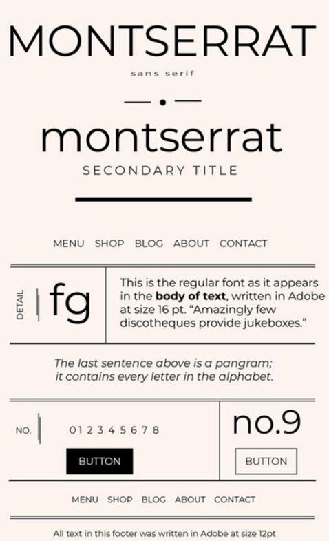
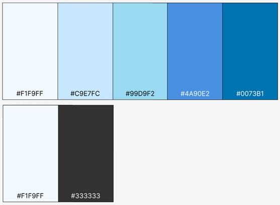
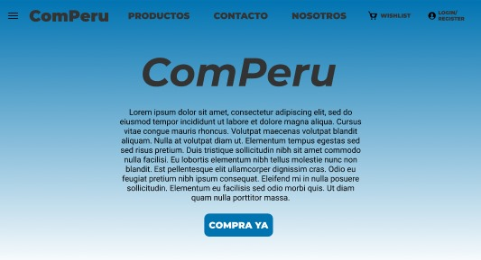
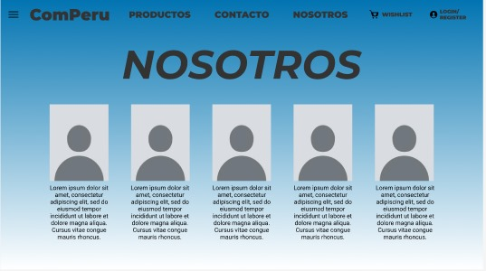
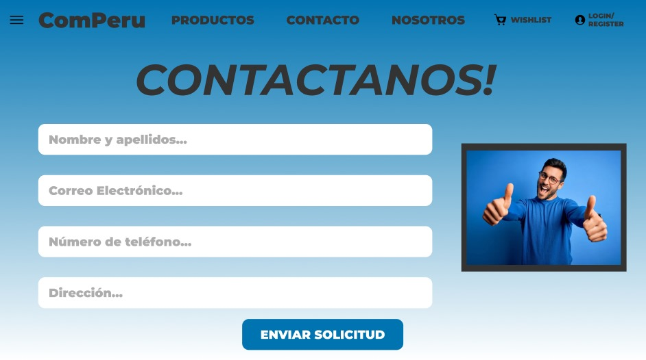
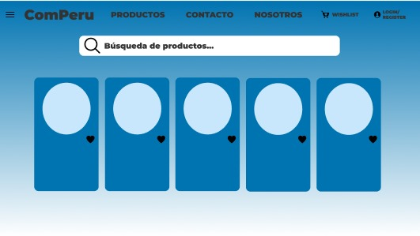

## CAPÍTULO 4: PRODUCT DESIGN

### 4.1. Style Guideline

4.1.1 General Style Guidelines

Tipografía:
Para el desarrollo de nuestro proyecto, en el apartado de la tipografía de los textos de la aplicación web y el landing page, utilizaremos dos de las fuentes más populares en la industria del diseño: Montserrat (como fuente principal) y Roboto (como fuente secundaria). 

Montserrat nos dará una mejor visibilidad para la aplicación ya sea vista en una PC o dispositivo móvil, además que su diseño distintivo ayudará con la imagen general del producto.

Por su parte, Roboto nos ofrece una fuente adaptable capaz de ser usada en diferentes partes de la aplicación, y dará a los usuarios en potencia una experiencia agradable y familiar

Colores:
Para el desarrollo de la aplicación, optamos por colores que apoyen a la confianza del usuario en el producto y garanticen una vista agradable para todos los involucrados. Hemos optado por:

- Los colores hexadecimales #99D9F2, #4A90E2, #0073B1, #C9E7FC, y #F1F9FF para el cuerpo general de la aplicación (siendo estos diferentes tonos de azul)
- Los colores hexadecimales #F1F9FF y #333333 para los textos principales y secundarios de la aplicación y el landing page (al ser estos fáciles de resaltar en comparación de los colores del cuerpo)

Lenguaje:
Nos decidimos por usar un nivel de lenguaje informal y entusiasta para nuestra aplicación, enfocado en crear una conexión emocional con el usuario. La idea es llegar al usuario de una forma fácil de entender y sin usar demasiados tecnicismos, asegurándose de que cualquier usuario pueda entender la aplicación sin importar su nivel de experiencia tecnológica. Es importante que el lenguaje utilizado en nuestra aplicación sea directo y conciso para que los usuarios puedan comprender fácilmente las funciones de la aplicación y la información proporcionada. Los mensajes de la aplicación deben ser claros y breves, evitando cualquier ambigüedad o confusión. El uso de un lenguaje claro y sencillo también puede ayudar a aumentar la accesibilidad de la aplicación para un público más amplio.

4.1.2. Web Style Guidelines

Una aplicación como la nuestra depende explicitamente que sea lo más sencilla de navegar por cualquier usuario que la tenga a su alcance; por lo tanto, aplicando todos los elementos descritos en el apartado anterior, se buscará diseñar una aplicación que pueda ser explorada por los usuarios de forma efectiva mientras se transmite un aire de seguridad al tener que manejar dinero y otros bienes dentro del sistema.
Gracias a un diseño responsivo, y el uso de elementos gráficos que no sean demasiado rígidos a la vista, se espera que la aplicación de una buena imagen para mantener al usuario interesado y al mismo tiempo bien informado de todo el funcionamiento interno de la aplicación.

### 4.2. Information Architecture

4.2.1. Organization System

En esta sección se definirá los sistemas de organización que permitirán estructurar y etiquetar el contenido de manera que resulte comprensible y fácil de encontrar para los usuarios.

- **Jerarquia de contenido:** Diseñaremos una jerarquía de contenido que refleje las distintas categorías de productos ofrecidos en la plataforma. Se estableceran secciones principales como : electronica, moda, deportes, entretenimiento, etc. Así mismo, en cada una de estas categorías existirán diferentes subcategorías según se considere necesario (electrodomésticos, ropa de niños, fútbol, etc).

- **Categorización:** Se estableceran grupos de productos en distintas categorías coherentes para mejorar la navegación de los usuarios. Se utilizarán criterios como la marca u otras características importantes. 

- **Funcionalidad de comparación:** Desarrollaremos una funcionalidad de comparación que permita a los usuarios comparar facilmente caracteristicas, precios y otros atributos importantes de los productos de su interes.

4.2.2. Labelling System

En esta seccion se describe el sistema de etiquetado utilizado para nombrar elementos dentro de la plataforma.

- **Etiquetas de menú:** Realizaremos etiquetas que representen cada uno de los menús de nuestra plataforma. Se vera representado cada una de las herramientas y funciones en la plataforma. 

- **Etiquetado descriptivo:** Cada producto estará etiquetado con información descriptiva de manera clara y precisa. Se incluirá detalles como nombre del producto, marca, modelo, tamaño, color , etc. 

- **Etiquetas de categoría:** Se utilizará etiquetas de categorías para organizar todos los productos disponibles en la plataforma de manera que facilite la navegación y búsqueda por parte de los usuarios. 

- **Etiquetas de estado:** Aquí se implementan etiquetas que representen el estado y disponibilidad de los productos (Descuentos, promociones, disponibilidad limitada, etc). 

4.2.3. SEO Tags and Meta Tags

- **Etiqueta de titulo:** Las etiquetas de título en el proyecto deben ser descriptivas y precisas , debe incluir palabras claves relevantes y tener una longitud adecuada para aparecer de forma correcta en los resultados de búsqueda.

- **Meta Description:** La meta descripcion al igual que los titulos debe ser clara, precisa y describir el contenido correctamente. Adicinonalmente, debe motivar a los usuarios a ingresar al sitio web para explorar la plataforma.

- **Meta Keywords:** Asignaremos palabras claves relevantes y específicas para el contenido de la página. 

- **Accesibilidad en la plataforma:** Incluiremos etiquetas que brinden accesibilidad para todo tipos usuarios. Una de las etiquetas mas significativas serian las Alt Tags  que sirven para describir el contenido de una imagen, lo cual resulta útil para los motores de búsqueda y es una ayuda importante para aquellos usuarios con discapacidad.  

4.2.4. Searching System

Se definirá los sistemas de búsqueda que se utilizarán en la plataforma para que el usuario pueda acceder a la información de manera rápido y sencilla.

- **Barra de búsqueda accesible:** Añadiremos una barra de búsqueda que sea notable en la interfaz del usuario (por lo general en la parte superior de la página). En esta funcionalidad los usuarios podran acceder a todo el contenido que la plataforma ofrece.

- **Filtros de búsqueda:** Incluiremos filtros de búsqueda que permitan a los usuarios encontrar lo que necesitan siguiendo diferentes criterios como el precio, marca, disponibilidad, categoría, etc.

- **Búsqueda por palabras claves:** Esta funcionalidad permitirá al usuario ingresar palabras claves para acceder a la información que desean.

- **Sugerencias de Búsqueda y autocompletado:** Se diseñará sugerencias de búsqueda y autompletado que ayudará a los usuarios a tener una búsqueda mucho más rápido y de esa manera crear una buena experiencia al momento de hacer uso de la plataforma. 

4.2.5. Navigation System

Se diseñará un sistema de navegación que proporcionará a los usuarios una experiencia de navegación intuitiva y eficiente.

- **Menú de navegación:** Incluiremos un menú de navegación que sea visible para el usuario. En este menú, el usario podrá acceder fácilmente a las herramientas y secciones principales que ofrece la página.

- **Navegación por categorías:** Diseñaremos una navegación por categorías en la plataforma. Estas categorías estarán etiquetadas y organizadas jerárquicamente tal y como se mencionó en el punto Organization System, lo cual hará la búsqueda una experiencia más agradable y rápida.

- **Navegación por Breadcrumbs:** Implementaremos una navegación por breadcrumbs la cual mostrará al usuario la ruta de navegación a través de la plataforma. Al desarrollar esta funcionalidad buscamos orientar al usuario mientras este explora la plataforma y accede a la información

- **Enlaces de acceso rápido:** Estos enlaces serian funcionalidades recurrentes que el usuario utiliza en la plataforma (carrito de compras, lista de deseo, perfil, configuración, cuenta, etc ). 
### 4.3. Landing Page UI Design

4.3.1 Landing Page Wireframes

4.3.2 Landing Page Mock-up

### 4.4. Web Applications UX/UI Design

### 4.6. Domain-Driven Software Architecture
Para el modelo de negocio que utilizaremos para desarrollar nuestro software complejo que se centra en la problematica que abordamos. para ello utilizaremos la tecnica de modelado C4 Model.
#### 4.6.1. Software Architecture Context Diagram
Este es el diagrama de Contexto de nuestro sistema:

#### 4.6.2. Software Architecture Container Diagram
Este es el diagrama de Contenedores de nuestro sistema:

#### 4.6.3. Software Architecture Components Diagram
Esto son los diagramas de componentes de nuestro sistema:

##### Diagrama de componentes #1:

##### Diagrama de componentes #2:

##### Diagrama de componentes #3:

##### Diagrama de componentes #4:

#### 4.7. Software Object-Oriented Design
##### 4.7.1. Class Diagrams
Para nuestro sistema, hemos implementado un diagrama de clases. Este diagrama visualiza la estructura estática del software, mostrando las clases, sus atributos y las relaciones entre ellas. Es una herramienta esencial que nos ayuda a comprender cómo se organizan y comunican las diferentes partes de nuestro sistema de software.

Diagrama de clases:

##### 4.7.2. Class Dictionary
Utilizamos la clase UserInterface la cual ayuda como padre para las clases Store, Customer, Admin, esta clase actua para modficar visualizar al usuario.

Tenemos la clase EntrepreneurContact que es el contacto ente usuario y la tienda para cualquier ayuda, actuando como personal de la tienda.

La clase *ShoppingCart* de compra esta clase es la que contendrá una relación de todos los productos que se van seleccionando a la hora de llevar a cabo la compra en la página web.

La clase Order encargada de representar la materialización, en compra, de un carrito que contiene productos y al que se le han añadido los datos del comprador en cuestión.

#### 4.7. Database desing
##### 4.7.1 Database Diagrams
Para nuestro sistema, también hemos implementado un diagrama de base de datos. Este diagrama proporciona una representación visual de la estructura de nuestra base de datos, incluyendo tablas, columnas y relaciones entre ellas. Es una herramienta clave para comprender la arquitectura de datos de nuestro sistema y cómo se relacionan entre sí las entidades de nuestra aplicación.

Para explicar nuestro sistema tenemos que entender que nuestras entidades son creadas con un fin que es dar un recibo al cliente.Para ello contamos con distitnas entidades que lo nutren que son Orders, Products, Stores, Customers, ademas, de un atributo SubTotal que es el del valor total de todos los productos.

Contamos con una entidad ComparateProducts que indica la constante comparacion de los productos.

Ademas, contamos con una entidad validateStock que es para verificar si el stock de X producto.

Por ultimo, tenemos la entidad supportChat que ayuda como data de chats de respuesta.

