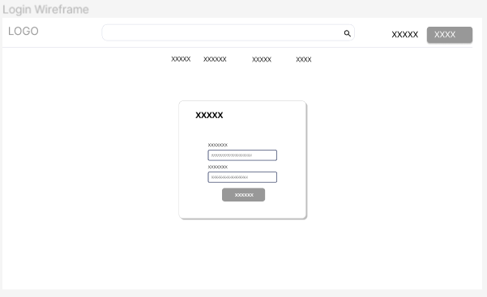
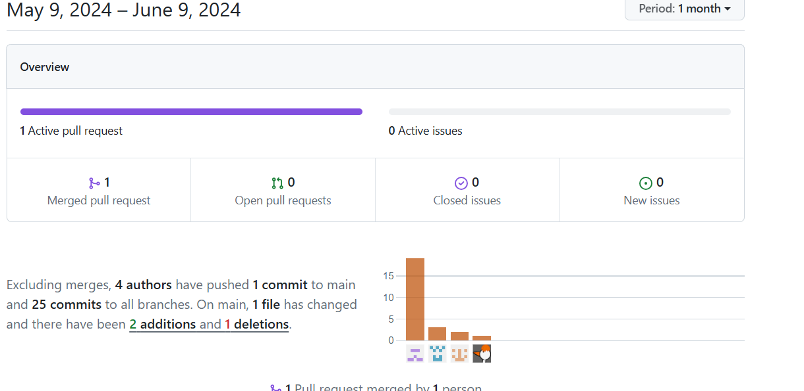

  <div align='center'>
    
    </div>
</tr>
<center>

# Universidad Peruana de Ciencias Aplicadas

### Ingeniería de Software
### Desarrollo de Aplicaciones Open Source
### WS51
### Juan Antonio Flores Moroco 
### " Informe del trabajo final "
### Nombre del StartUp: Innovation Digital
### Nombre del Producto: ComPerú
### Team Members

|   Members     |   User    |
|:-------------:|:---------:|
|Collantes Artola, Marco Antonio|u201410183|
|Reyes Trujillano, Fabian Alonso|u202218233| 
|Soriano Medrano, Diego|U202114793|
|Valenzuela Vallejos, Alessandro Stefano|u202214695| 
|Vasquez Villalobos, Elverth Jair|u202213070| 

</center>
<br><br>

# Registros de versiones del Informe

| Versión | Fecha | Autor | Descripción |
|---------|-------|-------|-------------|
|1.0.0|26/03/2024|Todos|Primera versión del documento|
|1.0.1|01/04/2024|Marco Collantes, Elverth Vasquez, Naggit Bayona | Primeros items del informe  |
|1.0.2|02/04/2024|Marco Collantes, Elverth Vasquez, Naggit Bayona|Actualización de elementos asignados|
|1.0.3|03/04/2024|Marco Collantes, Elverth Vasquez, Alessandro Valenzuela|Nuevos items y gráficos de secciones elegidas| 
|1.0.4|06/04/2024|Fabian Reyes|Capítulo 1 finalizado|
|1.0.5|07/04/2024|Marco Collantes|1er Registro de entrevistas|
|1.0.6|09/04/2024|Elverth Vasquez, Alessandro Villanueva|Actualización de capítulos 2,4,5|
|1.0.7|12/04/2024|Marco Collantes, Fabian Reyes, Alessandro Valenzuela|Actualización de items|
|1.0.8|14/04/2024|Todos|Version final primera entrega|
|1.0.9|27/04/2024|Elverth Vásquez Villalobos |Corrección de Entrevistas, Análisis de entrevistas y NeedFinding|
|2.0.0|27/04/2024|Todos|Desarrollo del trabajo Parcial|
|2.0.1|27/04/2024|Alessandro Valenzuela |Desarrollo de sprint planning 2 y sprint backlog 2|
|2.0.2|27/04/2024|Alessandro Valenzuela |Desarrollo de Authentication User|
|2.0.3|13/05/2024|Naggit Bayona, Alessandro Villanueva|Cambios tras entrega del TP|
|2.0.4|17/05/2024|Fabian Reyes, ELverth Vasquez|Cambios en las user stories y otras secciones|
|2.0.5|27/05/2024|Marco Collantes, Elverth Vasquez|Actualización previa al inicio del sprint 3|
|2.0.6|5/06/2024|Elverth Vasquez, Marco Collantes|Ajustes debido a cambio interno del equipo, preparación para entrega TB2|
|2.0.7|8/06/2024|Diego Soriano|Agregar partes realizadas y ajustes para lo realizado tanto en backend com frontend para entrega TB2|
||||
||||
<br><br>

# Project Report Collaboration Insights


<br><br>


**ABET – EAC - Student Outcome 3**

**Criterio:** Capacidad de comunicarse efectivamente con un rango de audiencias.
En el siguiente cuadro se describe las acciones realizadas y enunciados de 
conclusiones por parte del grupo, que permiten sustentar el haber alcanzado el logro 
del ABET – EAC - Student Outcome 3.

<br>

<table align="center">
    <tr>
      <th>Criterio específico</th>
      <th>Acciones Realizadas</th>
      <th>Conclusiones</th>
    </tr>
    <tr>
        <td>Comunica oralmente sus ideas y/o resultados con objetividad a público de diferentes especialidades y niveles jerarquicos, en el marco del desarrollo de un proyecto en ingeniería.</td>
          <td><strong>Collantes Artola, Marco Antonio</strong><br>
          <strong>TB1:</strong><br> 
          Durante esta entrega me centré en comunicarles a mis compañeros sobre las mejores maneras para realizar los items de esta entrega, aunque admito que experimenté complicaciones para adaptarme a su estilo de trabajo<br>
          <strong>TP:</strong><br> 
          En esta entrega me propuse en mejorar todo lo que pudiese respecto a la entrega anterior, así como mejorar la comunicación que tenía con mis compañeros por cualquier medio. Personalmente aún siento ciertos obstáculos para una comunicación efectiva al 100%, pero aprecio un poco la mejora<br> 
           <strong>TB2:</strong><br>
           Esta entrega nos llegó a abrumar un poco debido a todos los elementos que se tuvieron que actualizar y mejorar para un mejor producto posible, y hubo momentos en los que no se pudo llegar a un punto en común respecto al desarrollo. Aún así busqué alternativas para ver como mejorar el trabajo, y participé en lo que tenía control para que no se complicase más la situación.<br><br>  
         <strong>Valenzuela Vallejos, Alessandro Stefano</strong><br>
          <strong>TB1:</strong><br> 
          Durante la entrega me encargue de dar guia de como realizar las partes del trabajo de manera comunicativa, empatica y centrada. Para una mejor resolucion del trabajo.<br><br> 
           <strong>TP:</strong><br> 
          .<br>En esta entrega, mi objetivo fue mejorar en todos los aspectos posibles con respecto a entregas anteriores y fortalecer la comunicación con mis compañeros en todos los medios disponibles. Aunque reconozco que aún existen obstáculos para lograr una comunicación perfecta, noto cierta mejoría en este aspecto.

<br> 
           <strong>TB2:</strong><br> 
          <br>Durante esta fase, nos enfrentamos a una carga abrumadora de actualizaciones y mejoras necesarias para obtener un producto final de calidad. A pesar de los desafíos, busqué alternativas para mejorar nuestro trabajo y participé activamente en la búsqueda de soluciones para evitar complicaciones adicionales.<br>  
	        <strong>Vásquez Villalobos, Elverth Jair</strong><br>
          <strong>TB1:</strong><br> 
          Trabajamos en conjunto para resolver conflictos que se presentaron al desarrollar las entregas de cada uno de los items. Brindamos capacitación y ayuda a aquellos compañeros que tenían desconocimiento en el desarrollo del trabajo. <br><br> 
          <strong>TP:</strong><br> 
          En esta entrega mejoré varios aspectos críticos del trabajo, comuniqué a mis compañeros mis correcciones y mis avances. Así mismo, busqué mejorar la comunicación con el equipo para tener en claro la idea del proyecto y establecer una línea de desarrollo integral. Esto lo realicé mediante la comunicación escrita y oral en reuniones con el equipo para mejorar ciertos aspectos en el proyecto. <br><br> 
           <strong>TB2:</strong><br> 
          En esta entrega organicé a mis compañeros para poder culminar con las actividades respectivas y realizar mejoras en el proyecto. Debido a la incorporación de un nuevo integrante y el abandono de otro tuvimos que adaptarnos y tratar de conseguir una comunicación asertiva. Considero que esto no se ha cumplido del todo pese a intentar llegar a una organización óptima para el avance del proyecto. Realicé la repartición de asignaciones en el sprint backlog para cumplir con el desarrollo de la mayoría de funcionalidades que requiere la apliación.
          <br><br> 
          <strong>Reyes Trujillano, Fabian Alonso</strong><br>
          <strong>TB1:</strong><br> 
	        Trabajé junto a mis compañeros aportando con diferentes ideas, edición del informe, arquitectura del software, etc.<br><br> 
           <strong>TP:</strong><br> 
         o.<br> En esta entrega contribui con diferentes opiniones sobre el futuro de nuestro trabajo, a pesar de las dificultades que tuvimos.<br> 
           <strong>TB2: </strong><br> 
          .<br>En esta entrega tuve una participación más activa, finalizando con dos bounded context y aportando en algunos otros. A pesar de las dificultades que tuvimos, considero que nuestra entrega es correcta.<br> 
          <br><br> 
          <strong>Soriano, Diego</strong><br>
           <strong>TB2:</strong><br>
          Empecé a colaborar en el proyecto realizando las tareas que me designaron y tu ve que realizar partes de mejora tanto en el lado frontend de la aplicación y realizar tareas del lado backend consultando siempre con el equipo.
          <br><br>
          <td>
          <strong>TB1:</strong><br>
          Se requiere cierto nivel de comunicación para poder trabajar en una entrega tan completa como esta,de forma que se dé a conocer que es necesario para avanzar sin problemas<br><br>
          <strong>TP:</strong><br>
          Fue importante la organizacion de reuniones para mejorar los aspectos revisados y mejorar la idea del proyecto.
          <br><br>
           <strong>TB2:</strong><br>
          Llegamos a la conclusión de que necesitamos de una mejoría para la próxima entrega en cuestión de organización por parte del equipo . Esto lo iremos mejorando con reuniones en equipo y el uso de herramientas como Trello para la asignación de responsabilidades.
          <br><br>
        <td>
      </tr>
    <tr>
        <td>Comunica en forma escrita ideas y/o resultados con objetividad a público de diferentes especialidades y niveles jerarquicos, en el marco del desarrollo de un proyecto en ingeniería.</td>
          <td><strong>Collantes Artola, Marco Antonio</strong><br>
          <strong>TB1:</strong><br> 
          Me aseguré de redactar los items que me fueron asignados en el documento, así como informar a mis compañeros de cualquier avance o mejora que pude haber hecho respecto a la idea base del proyecto<br>
          <strong>TP:</strong><br> 
          Debido a las circunstancias que atravesamos en la entrega anterior no hubo muchos cambios respecto a esta entrega en mis items asignados, así que me dedique a buscar formas de mejorar el material existente en base a lo solicitado<br>
          <strong>TB2:</strong><br> 
          Experimenté algunas complicaciones menores para comunicarme con mis compañeros, pero mantuve la calma a la hora de trabajar seriamente en lo que se me fue asignado. Aunque admito que no toda la comunicación durante este sprint fue de la mejor condición, y el cambio del modelo de trabajo por parte del coordinador no me parece el mejor manejado<br><br>
          <strong>Valenzuela Vallejos, Alessandro Stefano</strong><br>
          <strong>TB1:</strong><br> 
          Para la entrega me encargue de realizar los diagramas que daran base para el desarrollo de nuestro sistema aplicando los principios basicos del diseño para cada tipo de diagrama.<br><br> 
          <strong>TP:</strong><br> 
          .<br>En esta entrega, no hubo cambios significativos en los elementos que me fueron asignados con respecto a la entrega anterior. Por lo tanto, me enfoqué en mejorar el material existente de acuerdo a las solicitudes previas.<br>
          <strong>TB2:</strong><br> 
         .<br>Durante este período, enfrenté algunas dificultades menores en la comunicación con mis compañeros. Sin embargo, mantuve la calma y me concentré en mi trabajo asignado. Aunque admito que la comunicación durante este sprint no fue óptima, considero que el cambio en el modelo de trabajo por parte del coordinador podría ser mejor gestionado.<br>
	        <strong>Vásquez Villalobos, Elverth Jair</strong><br>
          <strong>TB1:</strong><br> 
          Cumplimos con cada uno de los items designados a cada uno de los integrantes del equipo, nos aseguramos de comunicar el avance de cada miembro y utilizamos un repositorio para el registro de versiones y el avance en equipo. <br><br> 
          <strong>TP:</strong><br> 
          En esta entrega comuniqué las mejoras realizadas en items que fueron revisados por el docente. Traté de guiar a mi equipo para tener en claro la idea que estamos construyendo. He percibido mejora en la comunicación con mis compañeros pero considero que aún quedan aspectos a trabajarse. <br><br> 
          <strong>TB2:</strong><br> 
          Traté de comunicar mis ideas mediante mensajes y asignaciones en herramientas como Trello. Considero necesario mejorar la comunicación con el equipo para poder avanzar con el proyecto y cumplir con las entregas en el plazo establecido. 
          Así mismo, organicé el sprint backlog y realicé la asignación de tareas a mi equipo para culminar con el desarrollo del frontend de la aplicación y tener conocimiento del desarrollo del bounded context que se le asignó a cada integrante.
          <br><br>
	  <strong>Reyes Trujillano, Fabian Alonso</strong><br>
          <strong>TB1:</strong><br> 
          Me encargue de realizar los wireframes y mock-ups del landing page de nuestro trabajo, asi como completar con diferentes items de cada capítulo.<br><br> 
          <strong>TP: Me encargué de entregar la primera version del "product-page" que incluye una vista completa de los productos disponibles, una barra de búsqueda y un panel de filtros. </strong><br> 
          .<br><br>
          <strong>TB2:En esta entrega me encargué del desarrollo del frontend para el bounded context de Shipping, Wishlist y parte de otros bc, fue completado la wishlist de la plataforma, el carrito de compras, el formulario de envios, entre otras funcionalidades. Para la primera version del backend, implemente el bounded context de perfil de usuario y parte del bc de shipping.</strong><br> 
          .<br><br>
          <strong>Soriano, Diego</strong><br>
           <strong>TB2:</strong><br>
          Al desarrollar y colaborar en ciertos aspectos para la mejoria de la aplicación note la necesidad de comunicar necesidades y obsevaciones al equipo sobre aspectos relacionados al dominio del negocio que no estaban del todo claros.
          <br><br>  
        <td>
         <strong>TB1:</strong><br>
          Fue importante la comunicacion para la organizacion del informe y la construccion de la idea del proyecto.
          <br><br>
          <strong>TP:</strong><br>
          En este entrega fue importante la comunicacion mediante diferentes medios , ya sea por reuniones con el equipo o por mensajes de texto para comunicar los cambios realizados en el informe.
          <br><br>
           <strong>TB2:</strong><br>
          Para esta entrega fue importante la comunicación mediante de mensajes de textos y el uso de herramientas de asignación de tareas como Trello. Mediante el uso de estas herramientas cada miembro del equipo tenía conocimiento de las tareas que estaba desarrollando su compañero y de esa manera tener un avance óptimo en la creación de nuestra RESTful Api y la culminación del Frontend.
          <br><br>
        <td>
    
   </tr>    
  </tr>
</table>

# Contenido


<br><br>

# Índice

## 1. Capítulo I: Introducción

- [1.1 Startup Profile](#11-startup-profile)
    - [1.1.1 Descripción de la Startup](#111-descripción-de-la-startup)
    - [1.1.2 Perfiles de integrantes del equipo](#112-perfiles-de-integrantes-del-equipo)
- [1.2 Solution Profile](#12-solution-profile)
    - [1.2.1 Antecedentes y problemática](#121-antecedentes-y-problemática)
    - [1.2.2 Lean UX Process](#122-lean-ux-process)
        - [1.2.2.1 Lean UX Problem Statements](#1221-lean-ux-problem-statements)
        - [1.2.2.2 Lean UX Assumptions](#1222-lean-ux-assumptions)
        - [1.2.2.3 Lean UX Hypothesis Statements](#1223-lean-ux-hypothesis-statements)
        - [1.2.2.4 Lean UX Canvas](#1224-lean-ux-canvas)
- [1.3 Segmentos objetivo](#13-segmentos-objetivo)

## 2. Capítulo II: Requirements Elicitation & Analysis

- [2.1 Competidores](#21-competidores)
    - [2.1.1 Análisis competitivo](#211-análisis-competitivo)
    - [2.1.2 Estrategias y tácticas frente a competidores](#212-estrategias-y-tácticas-frente-a-competidores)
- [2.2 Entrevistas](#22-entrevistas)
    - [2.2.1 Diseño de entrevistas](#221-diseño-de-entrevistas)
    - [2.2.2 Registro de entrevistas](#222-registro-de-entrevistas)
    - [2.2.3 Análisis de entrevistas](#223-análisis-de-entrevistas)
- [2.3 Needfinding](#23-needfinding)
    - [2.3.1 User Personas](#231-user-personas)
    - [2.3.2 User Task Matrix](#232-user-task-matrix)
    - [2.3.3 User Journey Mapping](#233-user-journey-mapping)
    - [2.3.4 Empathy Mapping](#234-empathy-mapping)
    - [2.3.5 As-is Scenario Mapping](#235-as-is-scenario-mapping)

## 3. Capítulo III: Requirements Specification

- [3.1 To-Be Scenario Mapping](#31-to-be-scenario-mapping)
- [3.2 User Stories](#32-user-stories)
- [3.3 Impact Mapping](#33-impact-mapping)
- [3.4 Product Backlog](#34-product-backlog)

## 4. Capítulo IV: Product Design

- [4.1 Style Guidelines](#41-style-guidelines)
    - [4.1.1 General Style Guidelines](#411-general-style-guidelines)
    - [4.1.2 Web Style Guidelines](#412-web-style-guidelines)
- [4.2 Information Architecture](#42-information-architecture)
    - [4.2.1 Organization Systems](#421-organization-systems)
    - [4.2.2 Labeling Systems](#422-labeling-systems)
    - [4.2.3 SEO Tags and Meta Tags](#423-seo-tags-and-meta-tags)
    - [4.2.4 Searching Systems](#424-searching-systems)
    - [4.2.5 Navigation Systems](#425-navigation-systems)
- [4.3 Landing Page UI Design](#43-landing-page-ui-design)
    - [4.3.1 Landing Page Wireframe](#431-landing-page-wireframe)
    - [4.3.2 Landing Page Mock-up](#432-landing-page-mock-up)
- [4.4 Web Applications UX/UI Design](#44-web-applications-uxui-design)
    - [4.4.1 Web Applications Wireframes](#441-web-applications-wireframes)
    - [4.4.2 Web Applications Wireflow Diagrams](#442-web-applications-wireflow-diagrams)
    - [4.4.3 Web Applications Mock-ups](#443-web-applications-mock-ups)
    - [4.4.4 Web Applications User Flow Diagrams](#444-web-applications-user-flow-diagrams)
- [4.5 Web Applications Prototyping](#45-web-applications-prototyping)
- [4.6 Domain-Driven Software Architecture](#46-domain-driven-software-architecture)
    - [4.6.1 Software Architecture Context Diagram](#461-software-architecture-context-diagram)
    - [4.6.2 Software Architecture Container Diagrams](#462-software-architecture-container-diagrams)
    - [4.6.3 Software Architecture Components Diagrams](#463-software-architecture-components-diagrams)
- [4.7 Software Object-Oriented Design](#47-software-object-oriented-design)
    - [4.7.1 Class Diagrams](#471-class-diagrams)
    - [4.7.2 Class Dictionary](#472-class-dictionary)
- [4.8 Database Design](#48-database-design)
    - [4.8.1 Database Diagram](#481-database-diagram)

## 5. Capítulo V: Product Implementation, Validation & Deployment

  - [5.1. Software Configuration Management.](#51-software-configuration-management)
    - [5.1.1. Software Development Environment Configuration.](#511-software-development-environment-configuration)
      - [Project Mangement](#project-mangement)
      - [Requirements Management](#requirements-management)
      - [Product UX/UI Design](#product-uxui-design)
      - [Software Development](#software-development)
      - [Software Testing](#software-testing)
      - [Software Documentation](#software-documentation)
      - [5.1.2. Source Code Management.](#512-source-code-management)
    - [5.1.2. Source Code Management.](#512-source-code-management-1)
    - [Gitflow](#gitflow)
    - [5.1.3. Source Code Style Guide \& Conventions.](#513-source-code-style-guide--conventions)
    - [5.1.4. Software Deployment Configuration.](#514-software-deployment-configuration)
  - [5.2. Landing Page, Services \& Applications Implementation.](#52-landing-page-services--applications-implementation)
    - [5.2.1. Sprint 1](#521-sprint-1)
      - [5.2.1.1. Sprint Planning 1.](#5211-sprint-planning-1)
      - [5.2.1.2. Sprint Backlog 1.](#5212-sprint-backlog-1)
      - [5.2.1.3. Development Evidence for Sprint Review.](#5213-development-evidence-for-sprint-review)
      - [5.2.1.4. Testing Suite Evidence for Sprint Review.](#5214-testing-suite-evidence-for-sprint-review)
      - [5.2.1.5. Execution Evidence for Sprint Review.](#5215-execution-evidence-for-sprint-review)
      - [5.2.1.6. Services Documentation Evidence for Sprint Review.](#5216-services-documentation-evidence-for-sprint-review)
      - [5.2.1.7. Software Deployment Evidence for Sprint Review.](#5217-software-deployment-evidence-for-sprint-review)
      - [5.2.1.8. Team Collaboration Insights during Sprint.](#5218-team-collaboration-insights-during-sprint)
    - [5.2.2. Sprint 2](#522-sprint-2)
      - [5.2.2.1. Sprint planning 2](#5221-sprint-planning-2)
      - [5.2.2.2. Sprint Backlog 2](#5222-sprint-backlog-2)
      - [5.2.2.3. Development Evidence for Sprint Review.](#5223-development-evidence-for-sprint-review)
      - [5.2.2.4. Testing Suite Evidence for Sprint Review.](#5224-testing-suite-evidence-for-sprint-review)
      - [5.2.2.5. Execution Evidence for Sprint Review.](#5225-execution-evidence-for-sprint-review)
      - [5.2.2.6. Services Documentation Evidence for Sprint Review.](#5226-services-documentation-evidence-for-sprint-review)
      - [5.2.2.7. Software Deployment Evidence for Sprint Review.](#5227-software-deployment-evidence-for-sprint-review)
      - [5.2.2.8. Team Collaboration Insights during Sprint.](#5228-team-collaboration-insights-during-sprint)
    - [5.2.3. Sprint 3](#523-sprint-3)
      - [5.2.3.1. Sprint Planning.](#5231-sprint-planning)
      - [5.2.3.2. Sprint Backlog 3.](#5232-sprint-backlog-3)
      - [5.2.3.3. Development Evidence for Sprint Review.](#5233-development-evidence-for-sprint-review)
      - [5.2.3.4. Testing Suite Evidence for Sprint Review.](#5234-testing-suite-evidence-for-sprint-review)
      - [5.2.3.5. Execution Evidence for Sprint Review.](#5235-execution-evidence-for-sprint-review)
      - [5.2.3.6. Services Documentation Evidence for Sprint Review.](#5236-services-documentation-evidence-for-sprint-review)
      - [5.2.3.7. Software Deployment Evidence for Sprint Review.](#5237-software-deployment-evidence-for-sprint-review)
      - [5.2.3.8. Team Collaboration Insights during Sprint.](#5238-team-collaboration-insights-during-sprint)
    - [5.2.4. Sprint 4](#524-sprint-4)
      - [5.2.4.1. Sprint Planning.](#5241-sprint-planning)
    - [5.2.4.2. Sprint Backlog 4.](#5242-sprint-backlog-4)
    - [5.2.4.3 Development Evidence for Sprint Review.](#5243-development-evidence-for-sprint-review)
    - [5.2.4.4.Testing Suite Evidence for Sprint Review.](#5244testing-suite-evidence-for-sprint-review)
    - [5.2.4.5. Execution Evidence for Sprint Review.](#5245-execution-evidence-for-sprint-review)
    - [5.2.4.6. Services Documentation Evidence for Sprint Review.](#5246-services-documentation-evidence-for-sprint-review)
  - [Web service commit details](#web-service-commit-details)
        - [Link del repositorio:](#link-del-repositorio)
    - [5.2.4.7.Software Deployment Evidence for Sprint Review.](#5247software-deployment-evidence-for-sprint-review)
    - [5.2.4.8 Team Collaboration Insights during Sprint.](#5248-team-collaboration-insights-during-sprint)
  - [5.3. Validation Interviews.](#53-validation-interviews)
    - [5.3.1. Diseño de entrevistas.](#531-diseño-de-entrevistas)
    - [5.3.2. Registro de entrevistas.](#532-registro-de-entrevistas)
    - [Segmento 1: Clientes que suelen ir a frecuentar un bar](#segmento-1-clientes-que-suelen-ir-a-frecuentar-un-bar-1)
    - [Entrevista 1:](#entrevista-1-1)
    - [Entrevista 2:](#entrevista-2-1)
    - [Segmento 2: Empresarios del manejo bares](#segmento-2-empresarios-del-manejo-bares-1)
    - [Entrevista 3:](#entrevista-3-1)
    - [Evaluaciones según heurísticas.](#evaluaciones-según-heurísticas)
  - [5.4. Video About-The-Product.](#54-video-about-the-product)
    - [Video About-the-Product.](#video-about-the-product)

<br><br>

<br>

## CAPITULO 1: INTRODUCCIÓN

### 1.1. Startup Profile
#### 1.1.1. Descripción de la Startup

Somos una Startup peruana conformada por un equipo de cinco integrantes emprendedores apasinados por la tecnología y la innovación. 
Nuestra misión es proporcionar herramientas tecnológicas para impulsar el comercio local. Uno de nuestros objetivos es facilitar el crecimiento de pequeños y medianos emprendedores, brindandoles la oportunidad de competir en el mercado digital.

Con el aporte de experiencia técnica y habilidades blandas por parte de cada uno de los miembros de este equipo estamos comprometidos con brindar una buena experiencia a cada uno de nuestros usuarios, así como garantizar el éxito de los proyectos de cada uno de ellos.

#### 1.1.2. Perfiles de integrantes del equipo

|   |   |
|:-:|:-:|
| <p>Marco Collantes Artola (u201410183)</p> <p>Carrera: Ing. de Software, antes Ing. Electrónica</p> <p>Me considero bueno trabajando en equipo dando apoyo y asesoría cuando se necesita aplicar el ir un paso a la vez a la hora de desarrollar proyectos. Soy bueno a la hora de trabajar en programas como el Visual Studio, WebStorm, Word y Excel con notas y trabajos satisfactoriamente exitosos. Disfruto mucho de investigar sobre nuevos temas y soy fanático acérrimo del cine y la buena música.</p> |  |
| <p>Fabian Reyes Trujillano (u202218233)</p> <p>Carrera: Ing. de Software</p> <p>Considero que soy una persona segura de sí misma, capaz de tomar decisiones importantes y brindar ideas rápidas para solucionar un problema. Soy muy precavido en los problemas que se presentan habitualmente en el grupo, dando una respuesta óptima y concisa. Me gusta bastante escuchar música, disfruto especialmente del garage rock e indie.</p>|  |
| <p>Alessandro Stefano Valenzuela Vallejos (u202214695)</p> <p>Carrera: Ing. de Software</p> <p>Soy Alessandro Valenzuela alumno de la carrera de Ingenieria de software entre mis principales atributos soy una persona dedicada, perseverante y muy competitiva, me gusta relacionarme para crear un buen ambiente de trabajo para mí y mis compañeros. Tengo conocimiento en lenguajes de programación como c + + y en el desarrollo de bases de datos. Poseo buenas capacidades para solucionar distintos problemas para el desarrollo de un trabajo.</p>|<a href="https://imgbb.com/"></a> |
| <p>Elverth Vásquez Villalobos (u202213070)</p> <p>Carrera: Ing. de Software, </p> <p>Mi perfil se basa en ser una persona que cuando enfrenta un problema no se rinde hasta encontrar una solución. Considero que tengo una buena capacidad de análisis al momento de realizar algoritmos necesarios para el funcionamiento de algunos requerimientos en el software. Así mismo, me gusta siempre estar en comunicación con mi equipo de trabajo de una manera asertiva. Me apasiona el mundo de la tecnología y el emprendimiento, por ello trato de aportar al desarrollo del startup con mis habilidades en programación e investigación.</p> |  |
| <p>Soriano Medrano, Diego (U202114793)</p> <p>Carrera: Ing. de Software</p> <p>Ingeniería de software Soy una persona creativa y paciente, tengo conocimiento en el uso de diferentes herramientas informáticas y lenguajes de programación como C++ y Python, estas herramientas me ayudan a realizar distintos tipos de trabajo y a resolver problemas, parte de mis habilidades blandas es siempre tomar en cuenta la opinión de mis compañeros, lo cual me facilita el poder trabajar en equipo, para agilizar y optimizar el trabajo. En mis tiempos libres suelo navegar por internet.</p>|

### 1.2. Solution Profile

#### 1.2.1 Antecedentes y problemática

- **What:** La problematica que se quiere afrontar es la falta de acceso a comparaciones de precios precisas y actualizadas de pequeños y medianos emprendedores en nuestro país. Lo que resulta en un problema para los usuarios finales que enfrentan la dificultad de comparar precios con diferentes negocios, ello puede llevar a generar gastos innecesarios.

- **When:** Este problema surge durante el proceso de toma de decisiones de compra en el usuario final. Muchos de ellos se ven en la necesidad de compara precios en diferentes sitios web, redes sociales o tiendas físicas, para encontrar las mejores ofertas.

- **Where:** El problema afecta a los usuarios finales que buscan las mejores ofertas para los productos de su interes. Así mismo, los emprendedores también se ven afectados ante la poca visibilidad de sus productos y el valor agregado que ofrecen al mercado peruano.

- **Who:** Los principales afectados son las pequeñas y medianas empresas que buscan maximizar sus ganancias y los usuarios finales que desean adquirir el mejor producto al mejor precio.

- **Why:** La causa principal de este problema resulta en la falta de acceso a información actualizada de los precios de los productos. 

- **How:** Esta aplicación integrará datos actualizados de precios de pequeñas y medianas empresas en todo el país, permitiendo a los usuarios comparar precios de manera conveniente en un solo lugar. Además, implementaremos funciones de búsqueda avanzada y notificaciones de ofertas especiales para mejorar la experiencia del usuario. 

- **How Much:** Este problema afecta a muchos consumidores que buscan obtener productos al mejor precio posible. Así mismo, las empresas pequeñas y medianas se ven afectadas ya que muchas de ellas ofrecen buenas ofertas o valor agregado a un producto pero por la poca visibilidad del negocio no tienen los márgenes de ganacia esperados.

#### 1.2.2 Lean UX Process.
#### 1.2.2.1. Lean UX Problem Statements. 

- **Problema 1:** ComPeru se dedica a presentar las diferentes ofertas que tienen diferentes productos ofrecidos por múltiples emprendimientos. Los usuarios podrían encontrar abrumadora la cantidad de información presentada sobre las ofertas de productos, esto los dificultaria al momento de su elección sobre uno de estos. Por ello, se implementará un sistema de filtrado y organización, así como un diferente algoritmo de recomendación sobre ciertos productos para dentro de una interfaz sencilla y minimalista para facilitarle la navegación al usuario y mejorar su experiencia con nuestro servicio.
- **Problema 2:** En ComPeru, muchos emprendimientos y/o emprendedores empiezan a ofrecer diferentes productos en diferentes precios. Los usuarios tendrián un problema de desconfianza en la precisión o autenticidad de los precios y ofertas presentadas. Para solucionar este problema, se implementará una verificación de emprendedores y de pagos. Además se incluirá un sistema de calificaciones ehacia los emprendimietos, lo que los ayudará a ganar fama y buena reputación dentro de nuestro servicio.

#### 1.2.2.2. Lean UX Assumptions.

- Los usuarios aprecian la posibilidad de comparar rápidamente los precios y ofertas de distintos negocios para tomar decisiones de compra bien fundamentadas.
- Los usuarios confían en la veracidad y transparencia de la información sobre precios y ofertas que se muestra en la app, lo que les brinda la seguridad necesaria al momento de decidir qué comprar.
- Los usuarios tienen diversas preferencias de productos que incluyen tecnología, alimentos y otros rubros, lo que subraya la importancia de contar con una plataforma que permita comparaciones en múltiples categorías.
- Los usuarios se sienten motivados por la posibilidad de hallar ofertas exclusivas y descuentos especiales a través de la aplicación, lo que los impulsa a utilizarla como su principal fuente de compras en línea.

#### 1.2.2.3. Lean UX Hypothesis Statements

Para el caso de nuestro proyecto actual, hemos planteado las siguientes hipótesis con respecto a la implementación de nuestro proyecto:

- Creemos que si proporcionamos los usuarios de una aplicación web que les permita comparar precios de productos en diferentes tiendas, ellos utilizarán activamente la función de búsqueda de precios para encontrar el precio más bajo y tomar decisiones informadas de compra. Sabremos que es cierto, cuando nuestra aplicación sea usada para ello en un 65% de los casos.
- Creemos que si ofrecemos a los usuarios una función de recomendación de tiendas cercanas, así como opciones de pago en la aplicación web, encontrarán útil esta información y la utilizarán para seleccionar la tienda más conveniente y adecuada para sus necesidades de compra. Sabremos que es verdad al ver un incremento de esta función en una escala del 45 al 60% tras el lanzamiento oficial de la aplicación. 
- Creemos que si ofrecemos a los usuarios una función de búsqueda de promociones y descuentos por medio de la aplicación web, entonces ellos utilizarán activamente esta función para encontrar ofertas exclusivas y ahorrar dinero en sus compras. Sabremos que es verdad tras ver si esta función es de las más solicitadas por más del 50% de nuestros futuros usuarios, así como los comentarios de los mismos.
- Creemos que si proporcionamos a los usuarios una función de lista de compras en la aplicación, entonces los usuarios utilizarán esta función para organizar los productos que desean, además de recibir notificaciones sobre posibles cambios de precio o disponibilidad. Sabremos que es verdad cuando notemos un aumento significativo, estimado en un 55%, del uso de la app con este motivo.

#### 1.2.2.4. Lean UX Canvas

Procederemos entonces a presentar el Lean UX Canvas de nuestro futuro producto, y esperamos que se pueda lograr cumplir con todas nuestras expectativas durante los sprint de trabajo venideros.


### 1.3. Segmentos objetivo

En base al perfil de nuestro proyecto, hemos decidido que nuestros segmentos objetivo constarán de dos principales clientes:

- Compradores: Los cuales serán personas que buscan ahorrar dinero en sus compras y que valoran la conveniencia de encontrar las mejores ofertas en el menor tiempo posible.
- Emprendedores: Este segmento puede verse beneficiado con el servicio de nuestro emprendimiento, puesto que le ayudaría a comparar sus precios con posibles competencias cercanas y de ser posible mejorar su servicio.

Estos segmentos comprenderían a personas de todas las edades, tomando en cuenta sus posibles preferencias en materia de precios de productos y de distancia entre cada uno de los locales registrados en la aplicación. 


<br>

## CAPÍTULO 2: REQUIREMENTS ELICITATION & ANALYSIS
### 2.1 Competidores
Rakuten: Es una plataforma japonesa de compras en línea que ofrece una amplia gama de productos, desde electrónica hasta ropa y productos para el hogar. A través de Rakuten, los usuarios pueden comprar productos en múltiples tiendas y comparar precios. 
							
Wish: Es una aplicación de compras en línea que ofrece una amplia gama de productos a precios muy bajos. Wish se enfoca en productos directamente desde los fabricantes chinos y asiáticos, lo que significa que los productos pueden tardar más en llegar a los consumidores peruanos.
			
ShopSavvy: Es una aplicación de comparación de precios que permite a los usuarios escanear códigos de barras y buscar productos para encontrar el mejor precio disponible en línea o en tiendas cercanas. ShopSavvy puede ser una herramienta útil para los consumidores peruanos que buscan encontrar el mejor precio en tiendas cercanas.
			
#### 2.1.1. Analisis Competitivo

| Aspecto | ComPerú | Wish | Rakuten | ShopSavvy |
|---------|-----------|------|---------|-----------|
| **Nombre y Logo** | ComPerú | Wish | Rakuten | ShopSavvy |
| **Perfil** | 
| Overview | Plataforma de comparación de productos en Perú | Plataforma de compras en línea con una amplia variedad de productos | Marketplace global que ofrece productos de diversos vendedores | Aplicación que permite comparar precios y encontrar ofertas |
| **Ventaja Competitiva** | 
| Valor para los clientes | Comparación de precios locales, acceso a productos locales | Precios bajos y gran selección de productos | Variedad de productos de diferentes vendedores | Comparación de precios y ofertas |
| **Perfil de Marketing** |
| Mercado Objetivo | Consumidores en Perú buscando productos locales | Usuarios interesados en productos a bajo precio | Consumidores buscando productos de diversas categorías | Personas que buscan ofertas y comparan precios |
| Estrategias de Marketing | Promoción de productos locales, colaboraciones con tiendas locales | Descuentos, promociones especiales | Variedad de productos, promoción de vendedores | Comparación de precios, ofertas exclusivas |
| **Perfil del Producto** |
| Productos & Servicios | Comparación de productos locales en diversas categorías | Amplia variedad de productos en múltiples categorías | Marketplace con productos de diversos vendedores | Comparación de precios y búsqueda de ofertas |
| Precios & Costos | Gratis para usuarios, modelo de negocio basado en publicidad y colaboraciones | Precios competitivos, costos de envío | Comisión por ventas, tarifas de transacción | Gratis para usuarios, publicidad y asociaciones con tiendas |
| Canales de Distribución | Aplicación móvil y web | Plataforma móvil y web | Plataforma móvil y web | Aplicación móvil |
| **Análisis SWOT** |
| Fortalezas | Comparación de productos locales, enfoque en mercado específico | Gran selección de productos, precios bajos | Variedad de vendedores, alcance global | Comparación de precios, búsqueda de ofertas |
| Debilidades | Dependencia del mercado local, competencia con otras plataformas similares | Calidad variable de productos, largos tiempos de envío | Dependencia de vendedores externos, falta de control en calidad | Dependencia de datos de tiendas, competencia con otras aplicaciones similares |
| Oportunidades | Crecimiento del comercio electrónico en Perú, expansión a otros mercados locales | Crecimiento del comercio electrónico, expansión internacional | Diversificación de productos, alianzas con más vendedores | Aumento de usuarios interesados en ofertas y comparación de precios |
| Amenazas | Competencia con otras plataformas locales y globales, cambios en el mercado local | Competencia con otras plataformas, reputación por productos de baja calidad | Cambios en regulaciones comerciales, competencia con otras plataformas | Cambios en comportamiento del consumidor, competencia con otras aplicaciones de comparación de precios |


#### 2.1.2. Estrategias y tácticas frente a competidores. 

Teniendo en cuenta a nuestros competidores potenciales identificados, podemos considerar las siguientes estrategias y tácticas para diferenciarnos y destacar nosotros dentro del mercado:
- Ofrecer recomendaciones personalizadas: Para diferenciarnos de nuestros competidores, podemos utilizar la tecnología de inteligencia artificial para ofrecer recomendaciones personalizadas de productos y ofertas basadas en los hábitos de compra del usuario y su ubicación geográfica.
- Ofrecer una experiencia única al usuario con respecto a nuestra plataforma: Se podría enfocar en ofrecer una experiencia de usuario única y excepcional para diferenciarnos de la competencia. Esto incluiría un diseño atractivo, fácil de usar y rápido de cargar, así como un servicio al cliente excepcional para resolver cualquier problema o duda de los usuarios.
- Ofrecer un programa de lealtad hacia nuestros usuarios: Un programa de lealtad efectivo podría ser una forma de atraer y fidelizar a los usuarios. Esto podría incluir descuentos exclusivos para miembros, envío gratuito, regalos y otros beneficios.
- Establecer acuerdos con tiendas locales: Para diferenciarse de los competidores en línea, se podría establecer acuerdos con tiendas locales y pequeñas empresas para ofrecer productos y ofertas exclusivas a los usuarios. Esto ayudaría a promover el comercio local y generar lealtad de los consumidores.

### 2.2 Entrevistas
#### 2.2.1. Diseño de entrevistas
Este es el diseño de entrevistas a los usuarios para definir los estandares y preferencias que se va a tener en cuenta para el desarrollo de nuestra aplicacion. 
PREGUNTAS GENERALES:

•	¿Cuál es su nombre?

•	¿ Cuántos años tiene?

•	¿A qué se dedica?

•	¿Dirección actual?

**Preguntas para evaluación del segmento Compradores**

-	¿Con qué frecuencia utiliza su teléfono o computadora ?¿Para qué actividades lo utiliza? ¿Qué aplicaciones utiliza habitualmente?

-	¿Alguna vez verificaste en una página el precio de un producto?¿Que productos compra habitualmente?

-	¿Con qué frecuencia busca productos en páginas de internet para consultar precio o comprar online?

-	¿Tienes alguna tienda o centro comercial preferencial para hacer tus compras?¿Por qué no buscar otro ?

- De acuerdo al precio de los productos. ¿El precio de los productos que adquiere es bueno para usted? ¿por qué?

-	¿Cual es su método de pago habitual?

-	(EXPLICACION PREVIA DEL PRODUCTO)¿Estarías interesado en conocer este sitio web que logre encontrar el producto comparando otros productos?

-	¿Si encuentras el producto que necesitas a un precio módico en el website y recomienda una tienda confiable, recomendarías el sitio web que te ayude en tu compra?

**Preguntas para la evaluación del segmento Pequeños y Medianos Emprendedores**

- ¿Cuál es el principal producto o servicio que ofrece tu emprendimiento?

- ¿Cuál es el tamaño de tu negocio en términos de empleados y facturación anual?

- ¿Cómo promocionas actualmente tus productos o servicios y qué resultados has obtenido?

- ¿Qué desafíos has enfrentado al intentar aumentar la visibilidad de tu emprendimiento en línea?

- ¿Qué plataformas o herramientas utilizas actualmente para promocionar tus productos o servicios en línea?

- ¿Qué funcionalidades te gustaría ver en una plataforma de comparación de precios que te ayudaría a mejorar la visibilidad de tu emprendimiento?

- ¿Cómo crees que una plataforma de comparación de precios podría ayudarte a atraer nuevos clientes?

- ¿Qué funcionalidades adicionales te gustaría que tuviera la plataforma para facilitar la gestión de tu negocio?

- ¿Considerarías importante poder interactuar directamente con los clientes a través de la plataforma?

- ¿Cómo te gustaría que la plataforma ayudara a mejorar la visibilidad de tus productos entre los clientes potenciales?

#### 2.2.2. Registro de entrevistas

Hemos realizado el registro de las entrevistas realizadas a distinto tipo de usuarios.

**Link del video donde se contiene todas las entrevistas realizadas:**

https://upcedupe-my.sharepoint.com/:v:/g/personal/u202213070_upc_edu_pe/EZRP78qXy9hEh4NMmuu0qRkBqQfMfz-FP7GmY4cdib2wCg?e=hTOYCx&nav=eyJyZWZlcnJhbEluZm8iOnsicmVmZXJyYWxBcHAiOiJTdHJlYW1XZWJBcHAiLCJyZWZlcnJhbFZpZXciOiJTaGFyZURpYWxvZy1MaW5rIiwicmVmZXJyYWxBcHBQbGF0Zm9ybSI6IldlYiIsInJlZmVycmFsTW9kZSI6InZpZXcifX0%3D


**Entrevista #1:**


- Nombre y apellidos: Martha Artola Solis
- Edad: 54 años
- Ubicación: Pueblo Libre, Lima
- Breve resumen:
    La Sra Artola es un ama de casa de Pueblo Libre que constantemente hace uso de su teléfono para diferentes tareas, desde las comunicaciones más básicas y entretenimiento hasta las compras en línea que son nuestro punto de enfoque para la aplicación en desarrollo. El hecho de que esté al pendiente de diferentes artículos en línea, además de siempre estar al tanto de cualquier posible oferta que se le presente, ya muestra como nuestros futuros usuarios se podrían beneficiar de la aplicación y de como un correcto desarrollo puede llevar a tener un público asegurado para comenzar a destacar entre la competencia.
    
Link de la entrevista: https://upcedupe-my.sharepoint.com/:v:/g/personal/u202214695_upc_edu_pe/EfsVN0U18WVGgl6BB_6EiyUBVCVSTvlijeytpkoUIDVZlA?e=5X8cf0 (minuto 6:17)

**Entrevista #2:**

<a href="https://imgbb.com/"></a>
- Nombre y apellidos: Pablo Alejandro Mendez Urbano
- Edad:  21
- Ubicación: Huaral, Lima
- Duración de la entrevista: 4.38 minutos
- Breve descripción: 
	Pablo es un joven de 23 años de edad que actualmente trabaja como profesor de musica, me comenta que actualmente usa aplicaciones de compra online ya que le facilita mucho en distintos aspectos. Por lo que quisiera una aplicacion enfocada a la comparacion de distintas ofertas que se puedan presentar para ciertos productos, en su caso el interes por productos tecnologicos. Analizando la entrevista al sujeto observé el interes por nuestra solución debido a que seria de mucha ayuda tener una aplicacion que presente multiples opciones en cuanto a productos y en su caso para el rubro de la tecnologia, y que esta cuente con un metodo de pago de su preferencia.

Link de la entrevista:  https://upcedupe-my.sharepoint.com/:v:/g/personal/u202214695_upc_edu_pe/EfsVN0U18WVGgl6BB_6EiyUBVCVSTvlijeytpkoUIDVZlA?e=5X8cf0 (minuto 10:50)

**Entrevista #3:**


- Nombre y apellidos: Ernestos Casaverde
- Edad: 19
- Ubicación: Lima, Perú
- Duración de la entrevista: 6:13 minutos
- Breve decripción:
  Ernesto es un estudiante de 19 años, él es un comprador usual online. Nos comenta que habitualmente compra videojeugos, consolas y múltiples accesorios tecnológicos. Él nos afirma que una aplicación de comparación de precios sería ideal para sus necesidades. Además, esta de acuerdo a que los vendedores sean diferentes emprendimientos; ya que, piensa que en su mayoría las tiendas por departamento tienden a vender los productos a precios más inflados y también siente que estaría apoyando a algun vendedor independiente.
  
  Link de la entrevista: https://upcedupe-my.sharepoint.com/:v:/g/personal/u202214695_upc_edu_pe/EfsVN0U18WVGgl6BB_6EiyUBVCVSTvlijeytpkoUIDVZlA?e=5X8cf0 (minuto 0:01)
  
**Entrevista #4: Segmento Emprendedor**


- Nombre y apellidos: Iván Lavado Vallejos
- Edad:  19
- Ubicación: Chiclayo, Lambayeque
- Duración de la entrevista: 4.10 minutos
- Breve descripción: 

Iván es un joven de 19 años que cuenta con un pequeño emprendimiento de venta de accesorios para hombre. Actualmente trabaja solo, por lo que asumimos que es un negocio pequeño.

Él nos comenta que principalmente utiliza las redes sociales para promocionar y realizar las ventas de sus productos. Así mismo, cuenta que también ha participado en ferias de artesanía y en mercados locales buscando tener un mayor alcance a sus clientes.

Su principal desafío ha sido el competir con marcas grandes ya posicionadas en el mercado. Además el se encuentra en un mercado saturado donde destacar es algo difícil.

A Iván le encataría dar a conocer sus ofertas y promociones a través de nuestra plataforma para llegar a nuevos clientes. También hizo mención de una funcionalidad para poder personalizar la presentación de sus productos en la plataforma en donde pueda recalcar el estilo único de su negocio y poder marcar una diferencia con la competencia.

Por último, comentó la importancia de poder responder las preguntas de los clientes y brindarles atención personalizada para mejorar su experiencia de compra.

Link de la entrevista: https://upcedupe-my.sharepoint.com/:v:/g/personal/u202214695_upc_edu_pe/EfsVN0U18WVGgl6BB_6EiyUBVCVSTvlijeytpkoUIDVZlA?e=5X8cf0 (minuto 19:13)

 **Entrevista #5:**


- Nombre y apellidos: Khaterine Melissa Bautista Cruz
- Edad:  23
- Ubicación: Lima - Callao
- Duración de la entrevista: 4.28 minutos
- Breve descripción: <br><br>
	 Perfil y comportamiento de consumo:
  Catherine es una mujer joven de 23 años.
  Es una usuaria activa de tecnología, utilizando frecuentemente su celular y computadora para diversas actividades, como estudiar y ver contenido en línea.
  Tiene preferencia por comprar ropa en tiendas como Ripley o Saga, pero a veces se siente insatisfecha con los precios.
  Para otros productos, como abarrotes, compra en varios locales y a veces busca opciones más económicas.

  Factores de decisión de compra:

  Catherine valora tanto el precio como la calidad al tomar decisiones de compra. Está dispuesta a explorar diferentes opciones para encontrar el mejor valor por su dinero. Muestra interés en apoyar a emprendedores locales al buscar productos más económicos y diversificar sus compras.
  Ella prefiere métodos de pago digitales como Yape o Plin.

  Necesidades y oportunidades de mejora:

  Catherine expresó interés en una plataforma que ofrezca comparación de precios y variedad de productos, incluyendo opciones de emprendedores locales.
  Esta plataforma debería tener una interfaz fácil de usar y aceptar métodos de pago digital para adaptarse a sus preferencias.<br><br>


Link de la entrevista: https://upcedupe-my.sharepoint.com/:v:/g/personal/u202214695_upc_edu_pe/EfsVN0U18WVGgl6BB_6EiyUBVCVSTvlijeytpkoUIDVZlA?e=5X8cf0 (minuto 14:44)


 **Entrevista #6: Segmento Emprendedor** 


- Nombre y apellidos: Leonardo Delgado Arriola
- Edad:  19
- Ubicación: Chiclayo, Lambayeque
- Duración de la entrevista: 5.06 minutos
- Breve descripción: 

  Leonardo es un joven de 19 años que cuenta con una marca de ropa llamada BROWN INDUMENTARIA. Él se dedica a la venta de prendas para hombre y mujer a través de las redes sociales. Como nos menciona, es un sector que se encunetra bastante saturado por grandes empresas y marcas reconocidas. Para él esto resulta una gran dificultad para poder sacar adelante su negocio, ya que le hes difícil destacar y dar visibilidad de su emprendimiento a nuevos clientes potenciales.

  Para Leonardo una plataforma de comparación de precios le ayudaría a brindar más visibilidad a su negocio ,ya que las personas podrían descubrir sus ofertas, promociones y propuestas de valor.

  Así mismo, nos menciona que le sería útil tener herramientas de análisis y seguimiento para evaluar el rendimiento de sus promociones y campañas publicitarias.

  Finalmente, destacó la importancia de contar con reseñas y comentarios por parte de los usuarios para generar confianza en los nuevos clientes potenciales.

Link de la entrevista: https://upcedupe-my.sharepoint.com/:v:/g/personal/u202213070_upc_edu_pe/ERihsRMVE2xHiVbxz4j3bR4BSlvCh9kYvSTT8tSNn_sVOg?e=Mfu3hM&nav=eyJyZWZlcnJhbEluZm8iOnsicmVmZXJyYWxBcHAiOiJTdHJlYW1XZWJBcHAiLCJyZWZlcnJhbFZpZXciOiJTaGFyZURpYWxvZy1MaW5rIiwicmVmZXJyYWxBcHBQbGF0Zm9ybSI6IldlYiIsInJlZmVycmFsTW9kZSI6InZpZXcifX0%3D


#### 2.2.3. Análisis de entrevistas

En esta sección realizaremos un análisis cuantitativo y cualitativo de los datos recolectados en las entrevistas realizadas a cada uno de los segmentos objetivo de este proyecto.

**Estadísticas Demográficas:**

**Sexo:**
- Femenino: 2 entrevistadas (33.33 % de los entrevistados)
- Masculino: 4 entrevistados (66.67 % de los entrevistados)

**Ubicacion:**
- Lima - Callao: 1 entrevistada (16.67%)
- Lambayeque - Chiclayo : 2 entrevistados (33.33%)
- Lima - Huaral: 1 entrevistado (16.67%)
- Lima - Pueblo Libre: 1 entrevistada (16.67%)
- Lima -  (sin especificar distrito): 1 entrevistado (16.67%)

**Edad:**
- Menos de 20 años: 2 entrevistados (33.33%)
- Entre 20 y 29 años: 3 entrevistados (50%)
- Más de 50 años: 1 entrevistada (16.67%)
 
**Análisis de los datos proporcionados por los entrevistados:**

**Frecuencia de Uso de Dispositivos:** El 100 % de los entrevistados utilizan frecuentemente sus teléfonos o computadores para realizar sus actividades.

**Búsqueda de precios en línea:** El 100 % de los entrevistados admitió haber buscado precios de productos en páginas de internet.

**Frecuencia de compra en línea:** El 100 % de los entrevistados compra productos en línea de forma regular.

**Tamaño y facturación del negocio:** Se observa diversidad en el tamaño de los negocios entrevistados. En los datos encontramos que el 50 % son negocios individuales  y el otro 50 % podría considerarse un negocio mediano.

**Desafíos en la promoción en línea:** El 100 % de los emprendedores enfrentan desafíos para aumentar la visibilidad de sus negocios en línea. Además se recopiló que todos los entrevistados del segmento Emprendedor utilizan las redes sociales para realizar las ventas de sus productos.

**Necesidad de los compradores:** El 75 % de los compradores valoran la conveniencia y la variedad de opciones al buscar productos en línea.

**Métodos de pago:** El 100 % de los compradores prefieren realizar los pagos de manera digital.

**Necesidad de los emprendedores:** Este segmento desea herramientas para promocionar sus productos y evaluar el rendimiento de sus campañas.

**Interés en la plataforma de comparación de precios:** El 100 % de los entrevistados, tanto consumidores como emprendedores muestran interés en una plataforma de comparación de precios.

**Importancia de la interacción con los clientes:** Para el sector emprendedor resulta muy importante la capacidad de interactuar directamente a través de la plataforma, ya que el 100 % de los entrevistados de este segmento indicó que es un aspecto crucial para generar confianza con sus potenciales clientes.

**Conclusiones:**

- En cuanto a los datos demográficos se encontró que el rango de edades de nuestros entrevistados oscila entre los 20 a 29 años.

- En base a los datos recolectados podemos concluir que existe una demanda de plataforma de comparación de precios y que el mercado por el cual deberiamos inicar son los compradores y emprendedores de la ciudad de Lima ya que comprenden el 66.67 % de la muestra tomada para el análisis. Y el 100 % de de este porcentaje muestran interés en una plataforma de comparación de precios.

- Se identificó que para el 100 % de los emprendedores resulta crucial la implementación de herramientas de promoción y seguimiento de sus resultados.

- Se pudo conocer que para el 100 % de los emprendedores es de gran interés la implementación de funcionalidades para interactuar con los clientes , ya que esto genera confianza y lealtad para su negocio.

 ---


### 2.3. Needfinding.

<div align='justify'>
En esta sección se presentan los artefactos del proceso de análisis de la información recopilada de nuestros segmentos objetivos. Se incluyen las secciones de User Personas, User Task Matrix, User Journey Mappin,  y As-Is Scenario Mapping. 

</div>

2.3.1. User Personas

En esta sección presentaremos dos fichas de User Persona para nuestro producto,
el cual se enfoca en el cliente que va buscar productos en nuestra pagina y en las grandes y/o pequeñas Empresa y emprendedores. Estas
fichas están basadas en las principales características y necesidades identificadas
en el análisis de entrevistas y de la competencia.

#### Segmento objetivo 1 :  Cliente


#### Segmento objetivo 2 :  Empresas


2.3.2. User Task Matrix

Esta sección llamada User Task Matrix es una herramienta que nos sirve para
poder entender las tareas y objetivos que cada User Persona desea lograr a la
hora de utilizar nuestro producto. En esta sección, se presentarán las matrices de
tareas para los User Personas previamente definidos.


#### Cliente: Katherine M. Bautista Cruz

| Tarea / Aspecto | Frecuencia | Importancia |
|-----------------|------------|-------------|
| 1. Búsqueda de productos | Often | High |
| 2. Experiencia con diversas tiendas ( por departamento y/o emprendimientos) | Always | High | 
| 4. Soporte y Ayuda | Often | Medium |
| 5. Experiencia en el Sitio Web | Always | High |
| 6. Exploración de tiendas de emprendedores | Often | High |
| 7. Interacción Social | Often | Low |
| 8. Reservas de productos mediante la app | Rarely | High |
| 9. Recopilación de Experiencias | Often | Low |
| 10. Exploración de Promociones | Often | Low |
| 11. Métodos de Pago | Rarely | High |
| 12. Personalización de Notificaciones | Rarely | High |
| 13. Exploración de tiendas cercanas | Rarely | High |

#### Empresario: Iván Lavado Vallejos


| Tarea / Aspecto | Frecuencia | Importancia |
|-----------------|------------|-------------|
| Estrategias de Promoción | Always | High |
| Uso de Digital Marketing | Often | High |
| Promoción de Ofertas y Fechas Especiales | Often | High |
| Gestión de Promociones | Often | High |
| Sistema de Gestión de Inventarios | Often | High |
| Opinión sobre el Startup | - | - |
| Registro y Promociones para Clientes Nuevos | Sometimes | High |  
| Sugerencias para el Sitio Web | - | - |
| Facilidad de Uso del Sistema de Gestión de Inventarios | - | - |
| Accesibilidad Multiplataforma del Sitio Web | - | - |
| Soporte y Resolución de Problemas | - | - |

#### 2.3.3. User Journey Mapping

<a href="https://ibb.co/SQf5qQW"></a>

### 2.3.4. Empathy Mapping

<a href="https://ibb.co/5GCyqLR"></a>

#### 2.3.5. As-is Scenario Mapping

##### As-Is Scenario Map - Compradores 


##### As-Is Scenario Map - Pequeños y medianos emprendedores


### 2.4 Ubiquitous Language

| Término en Inglés | Traducción | Descripción |
|-------------------|---------------------|------------------------|
| Price Drop | Bajada de Precio | Reducción en el precio de un producto. |
| Flash Sale | Venta Flash | Oferta especial con descuento por tiempo limitado. |
| Referral Promotion | Promoción por Referidos | Descuento o beneficio otorgado por referir nuevos clientes. |
| Full Refund | Reembolso Total | Devolución del dinero completo al cliente en caso de insatisfacción. |
| Extended Warranty | Garantía Extendida | Oferta de protección adicional para un producto por un período más largo. |
| Express Delivery | Entrega Exprés | Servicio de entrega rápida con tiempos de envío reducidos. |
| Pre-order | Compra Anticipada | Reserva de un producto antes de su lanzamiento oficial. |
| Clearance Sale | Venta de Liquidación | Venta de productos con descuento para liquidar inventario. |
| Exclusive Offer | Oferta Exclusiva | Promoción disponible solo para ciertos clientes o grupos. |
| Loyalty Program | Programa de Fidelización | Sistema que recompensa a los clientes por su lealtad con puntos, descuentos u otros beneficios. |
| Seasonal Promotion | Promoción de Temporada | Oferta especial relacionada con una época del año. |
| Launch Offer | Oferta de Lanzamiento | Promoción especial disponible al momento del lanzamiento de un producto. |

## CAPÍTULO 3: REQUIREMENTS SPECIFICATION

### 3.1. To-Be Scenario Mapping

##### To-Be Scenario Map - Compradores 


##### To-Be Scenario Map - Emprendedores pequeños y medianos 


### 3.2. User Stories

|User Story ID|US01|
| :- | :-: |
|Title |Búsqueda de productos|
|Description |**Como** usuario **quiero** poder buscar productos **para** encontrar productos específicos |
|Acceptance criteria|<p>**Escenario 01 : Registro de datos** </p><p></p><p>**Dado que** el usuario quiere ingresar una palabra en el campo de búsqueda</p><p>**Y** haga clic en buscar</p><p>**Cuando** la app muestra los resultados correspondientes a esa palabra clave   </p><p>**Entonces** se deberá estar ordenados por relevancia </p>|

|User Story ID|US02|
| :- | :-: |
|Title |Filtrado de resultados por precios|
|Description |**Como** usuario **quiero** poder filtrar los resultados de búsqueda por precio **para** encontrar productos que se ajusten a mi presupuesto|
|Acceptance criteria|<p>**Escenario 01 : Registro de datos** </p><p></p><p>**Dado que** después de realizar una búsqueda apropiada a la necesidad del usuario </p><p>**Y** haga clic en buscar</p><p>**Cuando** la app muestra la selección de un rango de precios para filtrar los resultados </p><p>**Entonces** se mostrará en el rango estimado </p>|

|User Story ID|US03|
| :- | :-: |
|Title |Guardar productos en lista de deseos|
|Description |**Como** usuario **quiero** poder guardar productos en una lista de deseos **para** volver a ellos|
|Acceptance criteria|<p>**Escenario : Entrada de datos registrado**</p><p></p><p>**Dado que** el usuario agregar un producto a su lista de deseos </p><p>**Y** seleccionar en “Lista de deseos” </p><p>**Cuando** el producto pedido se guardará de manera automática </p><p>**Entonces** se mostrará en guardado el resultado que deseaba buscar </p><p></p><p>**Escenario : Salida de datos registrado**</p><p></p><p>**Dado que** el usuario quiera eliminar el producto después de su búsqueda </p><p>**Y** seleccionar en opción “Eliminar elemento”</p><p>**Cuando** el producto guardado se elimina instantáneamente de su lista de deseos</p><p>**Entonces** se mostrará el producto solo en la seccion de busqueda</p>|

|User Story ID|US04|
| :- | :-: |
|Title |Ordenamiento de resultados por clasificación|
|Description |**Como** usuario **quiero** poder ordenar los resultados de búsqueda por clasificación para ver los productos más populares primeros |
|Acceptance criteria|<p>**Escenario : Popularidad de registro** </p><p></p><p>**Dado que** el usuario quiera mostrar los resultados obtenidos se le mostrará la opción “Por  clasificación o por configuración”</p><p>` `**Y** el usuario deberá selecciona una de las dos opciones</p><p>**Cuando** después de seleccionar el sistema se configura automáticamente </p><p>**Entonces** cada que muestre los resultados también se agregaran las ofertas o descuentos del producto por su clasificación</p><p></p>|

|User Story ID|US05|
| :- | :-: |
|Title |Comparación de precios|
|Description |**Como** usuario **quiero** poder comparar productos de diferentes tiendas para encontrar la mejor opción de compra |
|Acceptance criteria|<p>**Escenario: Comparación de precios** </p><p></p><p>**Dado que** estoy en la pantalla de resultados </p><p>**Y** haga clic en buscar</p><p>**Cuando** haga click en comparación de precios  </p><p>**Entonces** se mostrará una lista de precios de cada tienda que venda el producto </p><p>**Y** podré hacer click en el producto para ver más detalles del producto y la tienda </p>|

|User Story ID|US06|
| :- | :-: |
|Title |Notificaciones de precios |
|Description |**Como** usuario **quiero** recibir notificaciones cuando los productos que estoy buscando estén disponibles o en oferta |
|Acceptance criteria|<p>**Escenario 1:Configuración de Notificaciones** </p><p></p><p>**Dado que** estoy en la pantalla de detalles de un producto</p><p>**Cuando** haga click en el boton de configuracion de notificaciones</p><p>**Entonces** la app me permitirá seleccionar el tipo de notificación que quiero recibir(Disponibilidad o oferta) </p><p>**Y** puedo elegir cómo quiero recibir la notificación (notificación de la app)</p>|

|User Story ID|US07|
| :- | :-: |
|Title |Comentarios y reseñas de productos |
|Description |**Como** usuario **quiero** poder leer comentarios y reseñas de otros usuarios sobre un producto para tomar una decisión de compra informada |
|Acceptance criteria|<p>**Escenario 01: Ver comentarios y reseñas** </p><p></p><p>**Dado que** estoy en la pantalla de detalles de un producto</p><p>**Cuando** haga clic en el botón de comentarios y reseñas </p><p>**Entonces** la app me muestra una lista de todos los comentarios y reseñas sobre un producto </p><p>**Y** podré ver el nombre de usuario, la calificación y el comentario de cada usuario </p><p></p><p>**Escenario 02: Dejar comentarios y reseñas** </p><p></p><p>**Dado que** estoy en la pantalla de detalles de un producto</p><p>**Cuando** haga clic en el botón de comentarios y reseñas </p><p>**Entonces** la app me permite escribir un comentario o reseña sobre el producto </p><p>**Y** la app publica mi comentario o reseña </p><p></p>|

|User Story ID|US08|
| :- | :-: |
|Title |Opciones de pago|
|Description |**Como** usuario **quiero** ver las opciones de pago disponibles en cada tienda para poder elegir la más conveniente|
|Acceptance criteria|<p>**Escenario 01: Ver opciones de pago**</p><p></p><p>**Dado que** estoy en la pantalla de detalles de una tienda</p><p>**Cuando** haga clic en el botón de opciones de pago</p><p>**Entonces** la app me muestra una lista de todos las opciones de pago disponibles en la tienda </p><p>**Y** puedo hacer clic en la opcion de pago para ver mas detalles de pago </p><p></p>|

|User Story ID|US09|
| :- | :-: |
|Title |Carrito de compras |
|Description |**Como** usuario **quiero** poder agregar productos a un carrito compras para pagar en conjunto mis productos|
|Acceptance criteria|<p>**Escenario 01: Crear una lista de compras**</p><p></p><p>**Dado que** estoy en la pantalla principal de la app</p><p>**Cuando** haga clic en el carrito de compras y veo los productos agregados</p><p>**Entonces** la app me permite tener un carrito de compras </p><p>**Y** poder agregar productos a los mismos</p><p>**Y** puedo hacer clic en el carrito de compras para ver los productos que he agregado</p><p></p><p>**Escenario 02: Agregar los productos seleccionado a la lista de compra** </p><p></p><p>**Dado que** estoy en la pantalla de detalles de un producto</p><p>**Cuando** haga clic en el botón de agregar al carrito</p><p>**Entonces** la app muestra que el producto se agrego exitosamente </p>|

|User Story ID|US10|
| :- | :-: |
|Title |Ofertas destacadas |
|Description |**Como** usuario **quiero** poder ver las ofertas más destacadas de la semana para aprovechar los mejores precios|
|Acceptance criteria|<p>**Escenario 01: Ver ofertas destacadas**</p><p></p><p>**Dado que** estoy en la pantalla de la app </p><p>**Cuando** desplazó hacia abajo en la pantalla </p><p>**Entonces** la app me muestra una sección de ofertas destacadas </p><p>**Y** puedo ver los productos en oferta y la cantidad de descuento</p><p>**Y** puedo hacer clic en un producto para ver los detalles y comprarlo </p><p></p>|

|User Story ID|US11|
| :- | :-: |
|Title |Contacto con la Startup |
|Description |**Como** usuario, **quiero** poder contactar al equipo de soporte de la empresa a través de la página de contacto para realizar consultas .|
|Acceptance criteria|<p>**Escenario : Cambiar contraseña** </p><p></p><p>**Dado que** el usuario está en la página de contacto </p><p>**Cuando** el usuario ingresa su consulta y hace clic en enviar </p><p>**Entonces** la consulta será enviada al equipo de soporte y el usuario recibirá una confirmación de envío. </p>|

|User Story ID|US12|
| :- | :-: |
|Title |Autenticacion de Usuario |
|Description |**Como** usuario **quiero** que la aplicación me permita registrarse y iniciar sesion en mi cuenta.|
|Acceptance criteria|<p>**Escenario : Registrar mi cuenta** </p><p></p><p>**Dado que** deseo registrarme </p><p>**Cuando** recien haya ingresado a la app </p><p>**Y** quiero registrarme  </p><p>**Entonces** colocare mi correo, usuario y contraseña para poder registrarme exitosamente.  </p><p>**Escenario : Ingresar a mi cuenta** </p><p></p><p>**Dado que** estoy en inicio y quiero ingresar a mi cuenta podre hacerlo desde el boton login </p><p>**Cuando** desee ingresar a mi cuenta en la app </p><p>¿**Entonces** solo colocare mi correo y mi contraseña para ingresar exitosamente  </p>|

|User Story ID|US13|
| :- | :-: |
|Title |Cambio de contraseñas |
|Description |**Como** usuario **quiero** que la aplicación me informe cada cierto tiempo a cambiar de contraseña para tener más seguridad.|
|Acceptance criteria|<p>**Escenario : Cambiar contraseña** </p><p></p><p>**Dado que** deseo cambiar mi contraseña </p><p>**Cuando** yo lo desee </p><p>**Y** este en la pestaña de usuario </p><p>**Entonces** podre cambiar mi contraseña desde la pestaña de usuario. </p>|

|User Story ID|US14|
| :- | :-: |
|Title |Registro de Tienda |
|Description |**Como** usuario **quiero** que la aplicación me informe cada cierto tiempo a cambiar de contraseña para tener más seguridad.|
|Acceptance criteria|<p>**Escenario : Registro de Tiendas** </p><p></p><p>**Dado que** el emprendedor está en la página de registro de tienda </p><p>**Cuando** el emprendedor ingresa la información requerida y hace clic en registrar </p><p>**Entonces** la tienda será creada en la plataforma y el emprendedor recibirá una confirmación de registro. </p>|


|User Story ID|US15|
| :- | :-: |
|Title |Gestión de productos |
|Description |**Como** emprendedor, **quiero** tener acceso a una interfaz intuitiva en la que pueda agregar, editar y eliminar productos de mi tienda, incluyendo información detallada como nombre, descripción y precio, **para** mantener actualizado el catálogo de productos de mi tienda en la plataforma.|
|Acceptance criteria|<p>**Escenario :  Gestión de productos** </p><p></p><p>**Dado que** el emprendedor está en la interfaz de gestión de productos </p><p> **Cuando** el emprendedor agrega, edita o elimina un producto </p><p>**Entonces** el catálogo de productos de la tienda se actualizará en la plataforma. </p>|

|User Story ID|US16|
| :- | :-: |
|Title |Notificación de pedidos |
|Description |**Como** emprendedor, **quiero** recibir notificaciones en tiempo real sobre nuevos pedidos realizados por usuarios finales en mi tienda, incluyendo detalles como el producto pedido y la dirección de envío, para poder procesar los pedidos de manera eficiente.|
|Acceptance criteria|<p>**Escenario :  Notificación de pedidos** </p><p></p><p>**Dado que** hay un nuevo pedido en la tienda del emprendedor </p><p> **Cuando** se realiza el pedido </p><p>**Entonces** el emprendedor recibirá una notificación con los detalles del pedido.  </p>|

|User Story ID|US17|
| :- | :-: |
|Title |Gestión de pedidos |
|Description |**Como** usuario emprendedor , **quiero** tener acceso a una interfaz intuitiva donde pueda revisar todos los pedidos que han realizado mis clientes, para poder realizar un seguimiento de las transacciones y gestionar el proceso de entrega de mis productos.|
|Acceptance criteria|<p>**Escenario :  Gestión de pedidos** </p><p></p><p>**Dado que** el emprendedor está en la interfaz de gestión de pedidos </p><p> **Cuando** el emprendedor revisa los pedidos </p><p>**Entonces** podrá ver los detalles de cada pedido y su estado actual. </p>|

|User Story ID|US18|
| :- | :-: |
|Title |Editar Tienda |
|Description |**Como** emprendedor, **quiero** tener acceso a una página de gestión de perfil donde pueda actualizar la información de mi tienda, incluyendo detalles de contacto y horarios de atención, para mantener actualizada y precisa la información que se muestra a los usuarios finales.|
|Acceptance criteria|<p>**Escenario :  Editar tienda** </p><p></p><p>**Dado que** el emprendedor está en la página de gestión de perfil de la tienda </p><p> **Cuando** el emprendedor actualiza la información de su tienda </p><p>**Entonces** los cambios se reflejarán en la información que se muestra a los usuarios finales. </p>|

|User Story ID|US19|
| :- | :-: |
|Title |Creación de Ofertas |
|Description |**Como** usuario emprendedor, **quiero** poder crear y administrar ofertas en mis productos, para atraer más clientes y aumentar las ventas en la plataforma.|
|Acceptance criteria|<p>**Escenario :  Creación de ofertas** </p><p></p><p>**Dado que** el emprendedor está en la interfaz de gestión de ofertas </p><p> **Cuando** el emprendedor crea una nueva oferta </p><p>**Entonces** la oferta será visible para los usuarios finales y aplicada a los productos seleccionados.</p>|

|User Story ID|US20|
| :- | :-: |
|Title |Notificación de Stock Bajo |
|Description |**Como** usuario emprendedor, **quiero** que el sistema me notifique cuando tenga el stock bajo de uno de mis productos, para poder abastecerme con antelación y no tener problemas con mis clientes.|
|Acceptance criteria|<p>**Escenario :  Notificación de Stock Bajo** </p><p></p><p>**Dado que** el stock de un producto está por agotarse </p><p> **Cuando** el stock llegue a un nivel mínimo </p><p>**Entonces** el emprendedor recibirá una notificación para reabastecerse. </p>|

|User Story ID|US21|
| :- | :-: |
|Title |Plataforma Responsive |
|Description| **Como** usuario **quiero** ingresar a la web en mi dispositivo móvil sin tener problema alguno.|
|Acceptance criteria|<p>**Escenario : Uso en dispositivo móvil** </p><p></p><p>**Dado que** que el usuario está utilizando la plataforma en su dispositivo móvil </p><p> **Cuando** el usuario navega por la plataforma </p><p>**Entonces** la interfaz se ajusta a la pantalla del dispositivo sin problemas. </p>|

|User Story ID|US22|
| :- | :-: |
|Title |Botones de acción |
|Description |**Como** usuario **quiero** que se implementen botones de acción claros para facilitarme el uso de la plataforma.|
|Acceptance criteria|<p>**Escenario :  Uso de botones de acción** </p><p></p><p>**Dado que** que el usuario está navegando por la plataforma </p><p> **Cuando** el usuario ve los botones de acción </p><p>**Entonces** los botones son claros y fáciles de usar, mejorando la experiencia del usuario. </p>|

|User Story ID|US23|
| :- | :-: |
|Title |Navegación intuitiva |
|Description |**Como** usuario **quiero** un menú inicial intuitivo **para** navegar de manera facil por la página.|
|Acceptance criteria|<p>**Escenario :** </p><p></p><p>**Given**  </p><p> **When**  </p><p>**Then** . </p>|

|User Story ID|US24|
| :- | :-: |
|Title |Detalle de un producto |
|Description |**Como** usuario **quiero** tener acceso a la página de detalles del producto **para** ver las especificaciones y tomar la decisión de compra.|
|Acceptance criteria|<p>**Escenario 1: Usuario accede a la página de detalles del producto desde la página principal**</p><p></p><p>**Given** que el usuario está en la página principal del sitio web </p><p>**When** hace clic en un producto específico </p><p>**Then** se redirige a la página de detalles de ese producto y se muestran las especificaciones completas.</p><p></p><p>**Escenario 2: Usuario accede a la página de detalles del producto desde la lista de búsqueda**</p><p></p><p>**Given** que el usuario ha realizado una búsqueda de productos </p><p>**When** selecciona un producto de los resultados de búsqueda </p><p>**Then** se redirige a la página de detalles de ese producto y se muestran las especificaciones completas.</p><p></p><p>**Escenario 3: Usuario accede a la página de detalles del producto desde una categoría específica**</p><p></p><p>**Given** que el usuario está navegando por una categoría específica de productos </p><p>**When** hace clic en un producto dentro de esa categoría </p><p>**Then** se redirige a la página de detalles de ese producto y se muestran las especificaciones completas.</p>|


|User Story ID|US24|
| :- | :-: |
|Title |Navegación intuitiva |
|Description |**Como** usuario **quiero** un menú inicial intuitivo **para** navegar de manera facil por la página.|
|Acceptance criteria|<p>**Escenario :** </p><p></p><p>**Given**  </p><p> **When**  </p><p>**Then** . </p>|

|User Story ID|US25|
| :- | :-: |
|Title |Navegación intuitiva |
|Description |**Como** desarollador, **quiero** implementar un RESTful API **para** el registro en línea donde pueda ingresar la información básica de la tienda, como nombre, dirección y categoría de productos, para poder crear una cuenta en la plataforma|
|Acceptance criteria|<p>**Escenario :** </p><p></p><p>**Given**  </p><p> **When**  </p><p>**Then** . </p>|


|User Story ID|US26|
| :- | :-: |
|Title |RESTFul API de Productos |
|Description |**Como** desarrollador **quiero** implementar un RESTful API de los productos, **para** tener acceso a los datos de los productos y realizar operaciones de gestión de inventario.|
|Acceptance criteria|<p>**Escenario 1: Crear un nuevo producto mediante la API**</p><p></p><p>**Given** que el desarrollador tiene acceso al endpoint de creación de productos </p><p>**When** envía una solicitud POST con los datos del nuevo producto </p><p>**Then** el producto se crea en la base de datos y se devuelve un código de estado 201 (Creado).</p><p></p><p>**Escenario 2: Actualizar un producto existente mediante la API**</p><p></p><p>**Given** que el desarrollador tiene acceso al endpoint de actualización de productos </p><p>**When** envía una solicitud PUT con los datos actualizados del producto </p><p>**Then** el producto se actualiza en la base de datos y se devuelve un código de estado 200 (OK).</p><p></p><p>**Escenario 3: Eliminar un producto mediante la API**</p><p></p><p>**Given** que el desarrollador tiene acceso al endpoint de eliminación de productos </p><p>**When** envía una solicitud DELETE con el ID del producto a eliminar </p><p>**Then** el producto se elimina de la base de datos y se devuelve un código de estado 204 (Sin Contenido).</p>|


### 3.3. Impact Mapping.

Una vez registradas las user stories de nuestra aplicación, procederemos a analizar los impactos más probables del mismo por medio de mapas de impacto y el planteamiento de metas para el negocio.


### 3.4. Product Backlog.

A continuación, procederemos a detallar el product backlog de nuestras user stories en donde analizaremos su importancia para el proyecto y los puntos que estaremos cubriendo en cada uno de los sprints de trabajo durante este ciclo.

| #Orden | User Story Id | Título | Descripción | Story Points (1/2/3/5/8) |
|--------|---------------|--------|-------------|--------------------------|
|01|US015|Gestión de productos|Como emprendedor, quiero tener acceso a una interfaz intuitiva en la que pueda agregar, editar y eliminar productos de mi tienda, incluyendo información detallada como nombre, descripción y precio, para mantener actualizado el catálogo de productos de mi tienda en la plataforma.|6|
|02|US05|Comparación de precios|Como usuario quiero poder comparar precios de un mismo producto en diferentes tiendas para encontrar la mejor opción de compra|6|
|03|US17|Gestión de pedidos|Como usuario emprendedor , quiero tener acceso a una interfaz intuitiva donde pueda revisar todos los pedidos que han realizado mis clientes, para poder realizar un seguimiento de las transacciones y gestionar el proceso de entrega de mis productos.|6|
|04|US01|Búsqueda de productos de palabra clave|Como usuario quiero poder buscar productos por palabra clave para encontrar productos específicos|5|
|05|US02|Filtrado de resultados por precios|Como usuario quiero poder filtrar los resultados de búsqueda por precio para encontrar productos que se ajusten a mi presupuesto|5|
|06|US024|Detalle de un producto|Como usuario, quiero tener acceso a la página de detalles del producto para ver las especificaciones y tomar la decisión de compra|5|
|07|US03|Guardar productos en lista de deseos|Como usuario quiero poder guardar productos en una lista de deseos para volver a ellos más tarde|5|
|08|US04|Ordenamiento de resultados por clasificación|Como usuario quiero poder ordenar los resultados de búsqueda por clasificación para ver los productos más populares primeros|5|
|09|US09|Carrito de compras|Como usuario quiero poder agregar productos a un carrito compras para pagar en conjunto mis productos|5|
|10|US19|Creación de Ofertas|Como usuario emprendedor, quiero poder crear y administrar ofertas en mis productos, para atraer más clientes y aumentar las ventas en la plataforma.|3|
|11|US07|Comentarios y reseñas de productos|Como usuario quiero poder leer comentarios y reseñas de otros usuarios sobre un producto para tomar una decisión de compra informada|3|
|12|US08|Opciones de pago|Como usuario quiero ver las opciones de pago disponibles en cada tienda para poder elegir la más conveniente|3|
|13|US10|Oferta destacada|Como usuario quiero poder ver las ofertas más destacadas de la semana para aprovechar los mejores precios|3|
|14|US06|Notificaciones de precios|Como usuario quiero recibir notificaciones cuando los productos que estoy buscando estén disponibles o en oferta|3|
|15|US12|Autenticacion de Usuario|Como usuario quiero que la aplicación me permita registrarse y iniciar sesion en mi cuenta.|3|
|16|US14|Registro de Tienda|Como emprendedor, quiero poder acceder a un formulario de registro en línea donde pueda ingresar la información básica de mi tienda, como nombre, dirección y categoría de productos, para poder crear una cuenta en la plataforma|3|
|17|US18|Editar tienda|Como emprendedor, quiero tener acceso a una página de gestión de perfil donde pueda actualizar la información de mi tienda, incluyendo detalles de contacto y horarios de atención, para mantener actualizada y precisa la información que se muestra a los usuarios finales.|3|
|18|US20|Notificación de Stock Bajo|Como usuario emprendedor, quiero que el sistema me notifique cuando tenga el stock bajo de uno de mis productos, para poder abastecerme con antelación y no tener problemas con mis clientes.|3|
|19|US11|Contacto con la Startup|Como usuario, quiero poder contactar al equipo de soporte de la empresa a través de la página de contacto para realizar consultas .|1|
|20|US21|Plataforma Responsive|Como usuario quiero ingresar a la web de ComPerú desde mi dispositivo móvil  para navegar rápidamente en la plataforma sin ningún problema de interfaz|1|

<br>

## CAPÍTULO 4: PRODUCT DESIGN

### 4.1. Style Guidelines.
#### 4.1.1 General Style Guidelines

Tipografía:
Para el desarrollo de nuestro proyecto, en el apartado de la tipografía de los textos de la aplicación web y el landing page, utilizaremos dos de las fuentes más populares en la industria del diseño: Montserrat (como fuente principal) y Roboto (como fuente secundaria). 

Montserrat nos dará una mejor visibilidad para la aplicación ya sea vista en una PC o dispositivo móvil, además que su diseño distintivo ayudará con la imagen general del producto.


Por su parte, Roboto nos ofrece una fuente adaptable capaz de ser usada en diferentes partes de la aplicación, y dará a los usuarios en potencia una experiencia agradable y familiar


Colores:
Para el desarrollo de la aplicación, optamos por colores que apoyen a la confianza del usuario en el producto y garanticen una vista agradable para todos los involucrados. Hemos optado por:

- Los colores hexadecimales #1B2854, #003758, #4466DF, y #1C85B para el cuerpo general de la aplicación (siendo estos diferentes tonos de azul)
- Los colores hexadecimales #000000 y #CACEDE para los textos principales y secundarios de la aplicación y el landing page (al ser estos fáciles de resaltar en comparación de los colores del cuerpo)


Lenguaje:
Nos decidimos por usar un nivel de lenguaje informal y entusiasta para nuestra aplicación, enfocado en crear una conexión emocional con el usuario. La idea es llegar al usuario de una forma fácil de entender y sin usar demasiados tecnicismos, asegurándose de que cualquier usuario pueda entender la aplicación sin importar su nivel de experiencia tecnológica. Es importante que el lenguaje utilizado en nuestra aplicación sea directo y conciso para que los usuarios puedan comprender fácilmente las funciones de la aplicación y la información proporcionada. Los mensajes de la aplicación deben ser claros y breves, evitando cualquier ambigüedad o confusión. El uso de un lenguaje claro y sencillo también puede ayudar a aumentar la accesibilidad de la aplicación para un público más amplio.

Nuestro Style Guideline general:


#### 4.1.2. Web Style Guidelines

Una aplicación como la nuestra depende explicitamente que sea lo más sencilla de navegar por cualquier usuario que la tenga a su alcance; por lo tanto, aplicando todos los elementos descritos en el apartado anterior, se buscará diseñar una aplicación que pueda ser explorada por los usuarios de forma efectiva mientras se transmite un aire de seguridad al tener que manejar dinero y otros bienes dentro del sistema.
Gracias a un diseño responsivo, y el uso de elementos gráficos que no sean demasiado rígidos a la vista, se espera que la aplicación de una buena imagen para mantener al usuario interesado y al mismo tiempo bien informado de todo el funcionamiento interno de la aplicación.


### 4.2. Information Architecture.

#### 4.2.1. Organization System

En esta sección se definirá los sistemas de organización que permitirán estructurar y etiquetar el contenido de manera que resulte comprensible y fácil de encontrar para los usuarios.

- **Jerarquia de contenido:** Diseñaremos una jerarquía de contenido que refleje las distintas categorías de productos ofrecidos en la plataforma. Se estableceran secciones principales como : electronica, moda, deportes, entretenimiento, etc. Así mismo, en cada una de estas categorías existirán diferentes subcategorías según se considere necesario (electrodomésticos, ropa de niños, fútbol, etc).

- **Categorización:** Se estableceran grupos de productos en distintas categorías coherentes para mejorar la navegación de los usuarios. Se utilizarán criterios como la marca u otras características importantes. 

- **Funcionalidad de comparación:** Desarrollaremos una funcionalidad de comparación que permita a los usuarios comparar facilmente caracteristicas, precios y otros atributos importantes de los productos de su interes.

#### 4.2.2. Labelling System

En esta seccion se describe el sistema de etiquetado utilizado para nombrar elementos dentro de la plataforma.

- **Etiquetas de menú:** Realizaremos etiquetas que representen cada uno de los menús de nuestra plataforma. Se vera representado cada una de las herramientas y funciones en la plataforma. 

- **Etiquetado descriptivo:** Cada producto estará etiquetado con información descriptiva de manera clara y precisa. Se incluirá detalles como nombre del producto, marca, modelo, tamaño, color , etc. 

- **Etiquetas de categoría:** Se utilizará etiquetas de categorías para organizar todos los productos disponibles en la plataforma de manera que facilite la navegación y búsqueda por parte de los usuarios. 

- **Etiquetas de estado:** Aquí se implementan etiquetas que representen el estado y disponibilidad de los productos (Descuentos, promociones, disponibilidad limitada, etc). 


#### 4.2.3. SEO Tags and Meta Tags

- **Etiqueta de titulo:** Las etiquetas de título en el proyecto deben ser descriptivas y precisas , debe incluir palabras claves relevantes y tener una longitud adecuada para aparecer de forma correcta en los resultados de búsqueda.

- **Meta Description:** La meta descripcion al igual que los titulos debe ser clara, precisa y describir el contenido correctamente. Adicinonalmente, debe motivar a los usuarios a ingresar al sitio web para explorar la plataforma.

- **Meta Keywords:** Asignaremos palabras claves relevantes y específicas para el contenido de la página. 

- **Accesibilidad en la plataforma:** Incluiremos etiquetas que brinden accesibilidad para todo tipos usuarios. Una de las etiquetas mas significativas serian las Alt Tags  que sirven para describir el contenido de una imagen, lo cual resulta útil para los motores de búsqueda y es una ayuda importante para aquellos usuarios con discapacidad.  

#### 4.2.4. Searching System

Se definirá los sistemas de búsqueda que se utilizarán en la plataforma para que el usuario pueda acceder a la información de manera rápido y sencilla.

- **Barra de búsqueda accesible:** Añadiremos una barra de búsqueda que sea notable en la interfaz del usuario (por lo general en la parte superior de la página). En esta funcionalidad los usuarios podran acceder a todo el contenido que la plataforma ofrece.

- **Filtros de búsqueda:** Incluiremos filtros de búsqueda que permitan a los usuarios encontrar lo que necesitan siguiendo diferentes criterios como el precio, marca, disponibilidad, categoría, etc.

- **Búsqueda por palabras claves:** Esta funcionalidad permitirá al usuario ingresar palabras claves para acceder a la información que desean.

- **Sugerencias de Búsqueda y autocompletado:** Se diseñará sugerencias de búsqueda y autompletado que ayudará a los usuarios a tener una búsqueda mucho más rápido y de esa manera crear una buena experiencia al momento de hacer uso de la plataforma. 


#### 4.2.5. Navigation System

Se diseñará un sistema de navegación que proporcionará a los usuarios una experiencia de navegación intuitiva y eficiente.

- **Menú de navegación:** Incluiremos un menú de navegación que sea visible para el usuario. En este menú, el usario podrá acceder fácilmente a las herramientas y secciones principales que ofrece la página.

- **Navegación por categorías:** Diseñaremos una navegación por categorías en la plataforma. Estas categorías estarán etiquetadas y organizadas jerárquicamente tal y como se mencionó en el punto Organization System, lo cual hará la búsqueda una experiencia más agradable y rápida.

- **Navegación por Breadcrumbs:** Implementaremos una navegación por breadcrumbs la cual mostrará al usuario la ruta de navegación a través de la plataforma. Al desarrollar esta funcionalidad buscamos orientar al usuario mientras este explora la plataforma y accede a la información

- **Enlaces de acceso rápido:** Estos enlaces serian funcionalidades recurrentes que el usuario utiliza en la plataforma (carrito de compras, lista de deseo, perfil, configuración, cuenta, etc ). 

### 4.3. Landing Page UI Design.
#### 4.3.1. Landing Page Wireframe.


#### 4.3.2. Landing Page Mock-up. 


### 4.4. Web Applications UX/UI Design.
#### 4.4.1. Web Applications Wireframes.   


User: 
 


<!--  -->





<!-- 


 -->


<!-- Bussines: -->

<!-- 


 -->


#### 4.4.3. Web Applications Mock-ups.

Para la implementación de los Mock-ups de las aplicaciones web, se siguieron los principios de diseño, elementos de diseño, diseño inclusivo y arquitectura de información que se planteó en puntos anteriores. El cual implican los siguientes aspectos:

Sencillez: Se utilizó un diseño simple y limpio para que el usuario pueda navegar fácilmente por la aplicación.

Consistencia: Se utilizó un diseño consistente en para mejorar la experiencia de usuario. Esto ayuda a los usuarios a identificar elementos familiares y entender mejor la jerarquía de la información.

Jerarquía Visual: Se utilizó un diseño que permite a los usuarios identificar fácilmente los elementos más importantes de la aplicación. Esto ayuda a los usuarios a comprender mejor la información y a tomar decisiones más rápidas.

Feedback: Se utilizó un diseño que proporciona comentarios visuales a los usuarios para que sepan que sus acciones se han realizado correctamente. Esto ayuda a los usuarios a comprender mejor el sistema y a evitar errores.

Diseño Inclusivo: Se utilizó un diseño que permite a los usuarios personalizar la aplicación según sus necesidades. Esto ayuda a los usuarios a sentirse más cómodos y a disfrutar de una experiencia de usuario más agradable.

Accesibilidad: Se utilizó un diseño que permite a los usuarios acceder a la aplicación desde cualquier dispositivo. Esto ayuda a los usuarios a utilizar la aplicación en cualquier momento y lugar.

Vista principal de la aplicación web:


El login de nuestra app web:


<!--  -->

El registro del nuestra app web:


<!--   -->

<!-- El perfil de nuestro user: 

  -->

<!-- Los planes de nuetra app web:
<!-- 
  --> 
<!-- 
El medio de pago de nuetra app web:

  -->

<!-- El inicio del Usuario:

 -->

<!-- Las categorias de nuestros usuarios:

  -->


<!--   -->

Lista de productos a ser comprados:

<!--   -->


El carrito de compras:

 

El contacto de nuestra app web:


El perfil del Empresario:

 

El inicio de nuestros empresarios:

 

El inventario de nuestro empresario:

 

Vista de los clientes del perfil Empresario: 

 

#### 4.4.4. Web Applications User Flow Diagrams.

### 4.5. Web Applications Prototyping.


**Link del Protype:**  https://www.figma.com/proto/nJkxHSMVbOuRTVvuYv4r1H/Open-source?type=design&node-id=47783-1469&t=4M86M8sUik2gOB7i-0&scaling=min-zoom&page-id=45348%3A1263&starting-point-node-id=47783%3A1469

**Figma del Protype:**  https://www.figma.com/file/nJkxHSMVbOuRTVvuYv4r1H/Open-source?type=design&node-id=45348-1263&mode=design&t=L5IuAsQGrHbB3iXB-0

### 4.6. Domain-Driven Software Architecture
Para el modelo de negocio que utilizaremos para desarrollar nuestro software complejo que se centra en la problematica que abordamos. para ello utilizaremos la tecnica de modelado C4 Model.
#### 4.6.1. Software Architecture Context Diagram
Este es el diagrama de Contexto de nuestro sistema:
<a href="https://ibb.co/qMZMfQ2"></a>

#### 4.6.1. Software Architecture Container Diagram
Este es el diagrama de Contenedores de nuestro sistema:
<a href="https://ibb.co/GTcc6J5"></a>

#### 4.6.1. Software Architecture Components Diagram
Esto son los diagramas de componentes de nuestro sistema:

<a href="https://ibb.co/rGpLnkH"></a>

<a href="https://ibb.co/2vwWxrN"></a>

#### 4.7. Software Object-Oriented Design
##### 4.7.1. Class Diagrams
Para nuestro sistema, hemos implementado un diagrama de clases. Este diagrama visualiza la estructura estática del software, mostrando las clases, sus atributos y las relaciones entre ellas. Es una herramienta esencial que nos ayuda a comprender cómo se organizan y comunican las diferentes partes de nuestro sistema de software.
Diagrama de clases:

<a href="https://ibb.co/TYkyVr3"></a>

### 4.7.2. Class Dictionary
Para la siguiente explicacion de los atributos de las clases, es crucial comprender los atributos de estas clases, ya que proporcionan información clave sobre la estructura y el funcionamiento del sistema. Documentar adecuadamente estos atributos facilita el desarrollo, la depuración y el mantenimiento del código, asegurando un sistema robusto y seguro


##### Clase: User

El atributo 'login' es un identificador único del usuario, mientras que 'password' representa la contraseña necesaria para acceder al sistema.
| Atributo  | Tipo de Dato | Descripción                         |
|-----------|--------------|-------------------------------------|
| login     | string       | Identificador único del usuario.    |
| password  | string       | Contraseña para acceder al sistema. |

##### Clase: admin
En la clase "admin", el atributo 'code' representa el código asociado al usuario administrador. Este código se utiliza para identificar y autenticar al administrador dentro del sistema.

| Atributo | Tipo de Dato | Descripción       |
|----------|--------------|-------------------|
| code     | String       | Código de usuario |


##### Clase: EntrepreneurContact

En la clase "EntrepreneurContact", el atributo 'contactName' representa el nombre del contacto del emprendedor, mientras que 'celphone' contiene el número de teléfono celular del contacto. Estos atributos son importantes para gestionar la información de contacto de los emprendedores en el sistema.

| Atributo     | Tipo de Dato | Descripción                           |
|--------------|--------------|---------------------------------------|
| contactName  | String       | Nombre del contacto del emprendedor.  |
| celphone     | String       | Número de teléfono celular.           |


##### Clase: Customer
En la clase "Customer", se registran los detalles relacionados con un cliente. Los atributos incluyen información personal como el nombre, apellido, número de identificación, dirección, código postal, fecha, correo electrónico y número de teléfono celular del cliente. Estos atributos son esenciales para gestionar la información de los clientes en el sistema.

| Atributo   | Tipo de Dato | Descripción                            |
|------------|--------------|----------------------------------------|
| name       | String       | Nombre del cliente.                    |
| dni        | String       | Número de identificación personal.     |
| lastName   | String       | Apellido del cliente.                  |
| codPostal  | String       | Código postal del cliente.             |
| date       | String       | Fecha relacionada con el cliente.      |
| email      | String       | Correo electrónico del cliente.        |
| celphone   | String       | Número de teléfono celular del cliente.|


##### Clase: Store
La clase "Store" representa una tienda en el sistema. Sus atributos incluyen el nombre de la tienda, su Registro Único de Contribuyentes (RUC), dirección, correo electrónico y número de teléfono celular. Estos atributos son importantes para gestionar la información de la tienda y establecer comunicación con ella.


| Atributo   | Tipo de Dato | Descripción                            |
|------------|--------------|----------------------------------------|
| name       | String       | Nombre de la tienda.                   |
| RUC        | String       | Registro Único de Contribuyentes.      |
| email      | String       | Correo electrónico de la tienda.       |
| celphone   | String       | Número de teléfono celular de la tienda.|


##### Clase: ShoppingCart
La clase "ShoppingCart" representa un carrito de compras en el sistema. El atributo 'amount' es de tipo float y representa el monto total de la compra en el carrito. Este atributo es esencial para realizar operaciones relacionadas con la gestión de compras y transacciones.

| Atributo   | Tipo de Dato | Descripción                            |
|------------|--------------|----------------------------------------|
| id     | int        | Identificador del carrito de compras.    |

##### Clase: Order
La clase "Order" representa una orden de compra en el sistema. Sus atributos incluyen el identificador único de la orden, las fechas de realización y límite de entrega, el método de entrega, la ciudad de entrega, el precio total, el descuento aplicado y un indicador de pago. Estos atributos son esenciales para gestionar las órdenes de compra y realizar un seguimiento adecuado de las transacciones.

| Atributo        | Tipo de Dato | Descripción                                 |
|-----------------|--------------|---------------------------------------------|
| OrderId         | String       | Identificador único de la orden.           |
| orderDate       | Date         | Fecha de realización de la orden.           |
| deliveryMethod  | String       | Método de entrega de la orden.              |


##### Clase: Product
La clase "Product" representa un producto en el sistema. Sus atributos incluyen un identificador único, una descripción, una URL de imagen, un nombre y un precio unitario. Estos atributos son fundamentales para gestionar la información de los productos y realizar transacciones comerciales en el sistema.

| Atributo    | Tipo de Dato | Descripción                            |
|-------------|--------------|----------------------------------------|
| ProductId   | String       | Identificador único del producto.      |
| description | String       | Descripción del producto.              |
| imageURL    | String       | URL de la imagen del producto.         |
| name        | String       | Nombre del producto.                   |
| unitPrice   | String       | Precio unitario del producto.          |

##### Clase: Model
La clase "Model" representa un modelo en el sistema. Sus atributos incluyen un identificador único, un nombre y una descripción. Estos atributos son importantes para gestionar la información de los modelos y facilitar su identificación y uso en el sistema.


| Atributo     | Tipo de Dato | Descripción                            |
|--------------|--------------|----------------------------------------|
| id           | String       | Identificador único del modelo.        |
| name         | String       | Nombre del modelo.                     |
| description  | String       | Descripción del modelo.                |

##### Clase: Category
La clase "Category" representa una categoría en el sistema. Sus atributos incluyen un identificador único, un nombre, una descripción y la categoría principal a la que pertenece. Estos atributos son esenciales para organizar y clasificar los elementos dentro del sistema según su tipo o función.

| Atributo      | Tipo de Dato | Descripción                           |
|---------------|--------------|---------------------------------------|
| idCategory    | String       | Identificador único de la categoría.  |
| name          | String       | Nombre de la categoría.               |
| description   | String       | Descripción de la categoría.          |
| category      | String       | Categoría principal o padre.          |

### Clase: Directions
La clase "Directions" representa la dirección de envío en el sistema. Sus atributos incluyen la dirección del destinatario, el código postal y la ciudad. Estos atributos son fundamentales para gestionar la información de envío y garantizar la entrega correcta de los productos.

| Atributo   | Tipo de Dato | Descripción                         |
|------------|--------------|-------------------------------------|
| direction  | String       | Dirección del destinatario.         |
| codPostal  | String       | Código postal del destinatario.     |
| city       | String       | Ciudad del destinatario.            |


### Clase: PriceProduct
La clase "PriceProduct" representa el precio de un producto en el sistema. Sus atributos incluyen el precio unitario del producto y un indicador booleano para determinar si hay un descuento aplicado al precio. Estos atributos son esenciales para calcular el costo total de los productos y aplicar descuentos si es necesario.

| Atributo    | Tipo de Dato | Descripción                            |
|-------------|--------------|----------------------------------------|
| unitPrice   | Variant      | Precio unitario del producto.          |
| discount    | Boolean      | Indicador de si hay descuento aplicado.|


#### 4.7. Database desing
##### 4.7.1 Database Diagrams
Para nuestro sistema, también hemos implementado un diagrama de base de datos. Este diagrama proporciona una representación visual de la estructura de nuestra base de datos, incluyendo tablas, columnas y relaciones entre ellas. Es una herramienta clave para comprender la arquitectura de datos de nuestro sistema y cómo se relacionan entre sí las entidades de nuestra aplicación.

<a href="https://ibb.co/YBNCyzB"></a>

## CAPÍTULO 5: PRODUCT IMPLEMENTATION, VALIDATION & DEPLOYMENT

### 5.1. Software Configuration Management

Se detallarán las herramientas necesarias para gestionar y controlar los cambios en el código e infraestructura del proyecto. 

5.1.1. Software Development Enviroment Configuration

En esta sección se definirá las herramientas y productos de software que se utilizará por cada uno de los integrantes para colaborar en la elaboración de esta plataforma. Se tomará en cuenta cada una de las fases del software , desde el nacimiento de la idea y documentación del proyecto hasta el despliegue de la plataforma.

| Herramienta | Propósito | Ruta de Descarga/Referencia |
|-------------|-----------|----------------------------|
| Git         | Control de versiones y colaboración en el código fuente del proyecto | [Git](https://git-scm.com/) |
| Jira Software | Gestión de tareas, seguimiento de problemas y planificación de tareas. Se podrá llevar a cabo una mejor gestión para cumplir con la metolodía SCRUM | [Jira Software](https://www.atlassian.com/software/jira) |
| Figma | Diseño de todas las interfaces de la aplicación y elaboración de un prototipo interactivo | [Figma](https://www.figma.com/) |
| Visual Studio Code | Codificación y desarrollo de software | [Visual Studio Code](https://code.visualstudio.com/) |
| Intellij IDEA | Codificación y desarrollo de software | [Intellij IDEA](https://www.jetbrains.com/idea/) |
| AWS (Amazon Web Services) | Despliegue y alojamiento de la aplicación | [AWS](https://aws.amazon.com/) |
| Markdown | Documentación técnica y de usuario | [Markdown Guide](https://www.markdownguide.org/getting-started/) |

5.1.2. Source Code Management

Nuestro proyecto seguirá los lineamientos del modelo GitFlow para controlar las versiones, donde utilizaremos GitHub como plataforma y sistema para el control de dichas versiones. Links del repositorio de GitHub:

- Link de la organización: https://github.com/NaggitBallona/Los-Reales-de-Open-Source
- Link de la landing page: 
- Link del informe: https://github.com/NaggitBallona/Los-Reales-de-Open-Source/blob/main/README.md
- Link del Front-end:
- Link del Back-end:

Estructura de las ramas:

- Main Branch: Rama principal de la aplicación. Se encuentran las versiones más actualizadas y estables de desarrollo, por medio de un proceso de admisión se agregan cambios de otras ramas derivadas.

- Develop Branch: Esta rama es donde se reunen de las demás ramas los avances del proyecto y desarollo. Se evalúan todos los cambios para ser registradas posteriormente en nuestra rama main.

5.1.3. Source Code Style Guide & Conventions

HTML: Varias de las mejores prácticas que hemos seguido para alcanzar un código limpio, ordenado, legible y escalable son mostradas a continuación:

- Se usan elementos HTML que tengan un significado claro y  preciso para el contenido que se está marcando. Por ejemplo, utiliza header, nav, main, article, section, aside, footer, entre otros, al estructurar la landing page, sin redundancia, por algún uso incorrecto o querer reinventar la rueda.
- HTML5 permite algunas etiquetas sin cierre (como "img" y "input"), sin embargo utilizamos la buena práctica de cerrar todas las etiquetas correctamente para evitar problemas de renderizado.
- Para mejorar la accesibilidad a nuestras clases, siempre incluimos el atributo alt en las etiquetas, "img" por ejemplo, para describir brevemente el contenido de la imagen.
- En HTML, es posible utilizar tanto mayúsculas como minúsculas en los nombres de elementos y atributos, pero nosotros utilizamos solo minúsculas para mantener el orden y facilitar la legibilidad del código.
- No omitir etiquetas principales e importantes como ```<html>```, ```<body>```,  ```<header>``` y más.
- Escribir en una línea los comentarios cortos.

CSS: Entre nuestras prácticas están:

- Los nombres de clases son claros, precisos y autodescriptivos.
- Separar los nombres de las clases y ID con guión, por ejemplo: ```#userWorker-id``` o ```button-shape{}```.
- Usar comentarios claros para explicar el código.
- Aplicar sangría al contenido de un bloque entero.
- Separar las declaraciones y selectores en nuevas líneas para tener una buena legibilidad y orden.

JavaScript: Principales buenas prácticas:

- Uso de prácticas de nomenclatura, en este caso camelCase para nombrar únicas variables y funciones. Por ejemplo, ```miVariable``` o ```miFuncion```.
- Uso de PascalCase para nombrar clases y constructores.Por ejemplo, ```MiClase```.
- Evitamos el uso de nombres de variables genéricos o ambiguos.
- Uso general de comentarios para explicar el propósito y funcionalidad de la porción del código.
- Uso de punto y coma al final de cada declaración.
- Uso de comillas simples ('') o comillas dobles ("") de forma consistente para las cadenas de texto.
- Uso de operadores ternarios, por ejemplo, ```(condición ? resultadoTrue : resultadoFalse)``` de manera cuidadosa según la legibilidad y dificultad del bloque de código.
- Evitación y eliminación del uso de funciones obsoletas o en desuso.
- Uso de ```try-catch``` para manejar y gestionar errores.
- Organización del código en bloques lógicos separados por líneas en blanco para mejorar la legibilidad.

#### 5.1.4 Software Deployment Configuration
Para desplegar el landing page resultó necesario cumplir una serie de requisitos, entre ellos, es necesario contar con una cuenta personal, una organización y un repositorio al cual cargar los documentos (se utilizará la plataforma Github Pages y Github Actions, para la implementación y despegue). Cumplido lo anterior, será posible comenzar el despliegue de la landing page. Estos son los pasos a seguir:

<ol>
  <li>Crear una carpeta Docs para alojar el landing page y especificar en Github Pages como fuente de la página.
  </li>
  <li>Asegurarse de que los archivos sigan los terminales correctos "index.html", para la landing page; "style.css" para los estilos y una carpeta "img" que contendrá las imágenes.
  </li>
  <li>Cargar los archivos mediante un push a la rama main del repositorio.</li>
  <li>Verificar que se haya desplegado correctamente.</li>
	
### 5.2. Landing Page, Services & Applications Implementation
#### 5.2.1. Sprint 1
#### 5.2.1.1. Sprint Planning 1 
El principal objetivo de este Sprint es crear la página de inicio de la aplicación "ComPeru". Esta será la primera experiencia que los usuarios tendrán con nuestra aplicación, por lo que es crucial que sea fácil de usar, atractiva y funcional. Nuestro propósito es atraer a los usuarios y motivarlos a utilizar nuestra aplicación para comparar precios de productos en su localidad.


| **Sprint #**                | Sprint 1 |
|-----------------------------|----------|
| **Sprint Planning Background**         |            
| **Date:**                   | 2024-04-22 |
| **Time:**                   | 7:00 pm |
| **Location:**               | Reunion Virtual |
| **Prepared By:**            | Valenzuela Vallejos, Alessandro Stefano |
| **Attendees (to planning meeting):** | Naggit Ballalona, Fabian Reyes, Marcos Collantes,  Vásquez Elverth |
| **Sprint n – 1 Review Summary**  |En este sprint se desarrolló la landing page de nuestro proyecto y las primeras páginas de nuestra aplicación web. |
| **Sprint n – 1 Retrospective Summary** |Es necesario mejorar la coordinación para el desarrollo en equipo de las principales páginas de la aplicación  |
| **Sprint Goal & User Stories** |
| **Sprint n Goal:**             | Dessarrollar Landing Page y primeras páginas de nuestra aplicación web.|
| **Sprint n Velocity:**         | (Definir el Velocity establecido para el Sprint n, es decir cuántos Story Points puede aceptar el equipo para este Sprint n.) |
| **Sum of Story Points:**       | (Colocar la suma de los Story Points para los User Stories que se están incluyendo en este Sprint n.) |


#### 5.2.1.2. Sprint Backlog 1 


Ahora presentaremos la primera tabla de los sprints backlogs:

**Sprint 1: Desarrollo de una primera versión del Landing Page**

| **User Story** | **Work-Item / Task** | **Título** | **Descripción** | **Estimación** | **Asignado a** | **Estado** |
|-|-|-|-|-|-|-|
|US21|US21-1|Plataforma Responsive|Realizado|Desarrollo de un landing page responsivo para nuestro producto|Alessandro Valenzuela|Completado|
|US22|US22-1|Botones de acción|Realizado|Desarrollo de botones para el movimiento del usuario dentro del landing page y su conexión con el producto|Alessandro Valenzuela|Completado|
|US23|US23-1|Navegación intuitiva|Realizado|Optimización de la barra de herramientas del landing page para la navegación|Alessandro Valenzuela|Completado|

#### 5.2.1.3. Development Evidence for Sprint Review

Los siguientes commit corresponden al desarrollo del landing page y las primeras versiones de las páginas y vistas para el usuario de la aplicación web:

| Repository | Branch | Commit Id | Commit Message | Commit Message Body | Commited on (Date) |
|------------|--------|-----------|----------------|---------------------|--------------------|
|LandingPage|main|0971160173dc0abca88a0b8afd7261b9bbb26fcc|Initial commit| |14/04/2024|
| |main|a5fd21aa1802777ef91e270cd76aa9f368e24d59|new| | 16/04/2024 |

##### 5.2.1.4. Testing Suite Evidence for Sprint Review

Debido a ser la primera entrega, y el poco conocimiento en general de este apartado, no se realizaron procesos de testing en nuestra aplicación o landing page.

| Repository | Branch | Commit Id | Commit Message | Commit Message Body | Commited on (Date) |
|------------|--------|-----------|----------------|---------------------|--------------------|
| | | | | | |

#### 5.2.1.5. Execution Evidence for Sprint Review

Podemos apreciar el landing page en funcionamiento: 


#### 5.2.1.6. Services Documentation Evidence for Sprint Review.

En el alcance del presente sprint, no se han utilizado servicios de web ya que se ha trabajado solamente el landing page estático. Por lo tanto, en esta presentación no se encuentra documentación de web services empleados.

#### 5.2.1.7. Software Deployment Evidence for Sprint Review.

Para el desarrollo del Landing Page  se ha utilizado los siguientes lenguajes:

Html: HyperText Markup Language, este lenguaje no ayudo a elaborar las estructuras de nuestra Langing Page.
Css: Cascading Style Sheet, es un lenguaje de diseño grafico que nos ayudo en los estilos de nuestro documento realizado en Html.
Para el despliegue del Landing Page se ha utilizado las siguientes herramientas:

Git: Sistema de control de versiones que nos ayudo a trabajar en equipo durante la elaboracion del Markdown
GitHub: Plataforma de desarrollo colaborativo que nos ayudo a guardar nuestros proyecto con sus respectivas versiones
Git Flow: Modelo de flujo de trabajo que nos permitio ver el avance de cada uno de los integrantes del grupo con respecto al trabajo elaborado.

#### 5.2.1.8. Team Collaboration Insights during Sprint.


#### 5.2.1. Sprint 2
##### 5.2.2.1. Sprint Planning 2.

El principal objetivo del Sprint 2 fue el desarrollo de las principales funcionalidades de nuestra aplicación. Todas las características desarrolladas en este Sprint se encuentran bajo el dominio del negocio y representan las principales funcionalidades que debería de tener nuestro software para convertirse en un  MVP (Minimun Viable Product). Se escogieron User Stories relacionadas al lado Front-End de nuestra aplicación web y se implementaron la mayoría de los escenarios establecidos.


| **Sprint #**                | Sprint 2 |
|-----------------------------|----------|
| **Sprint Planning Background** |            |
| **Date:**                   | 2024-05-01 |
| **Time:**                   | 7:00 pm |
| **Location:**               | Se tuvieron reuniones de manera virtual y en el aula de clase para mencionar los avances de cada integrante del equipo. |
| **Prepared By:**            | Vásquez Villalobos Elverth Jair|
| **Attendees (to planning meeting):** |Vásquez Elverth,  Naggit Ballalona, Fabian Reyes, Marcos collatnes,  Valenzuela Alessandro|
| **Sprint 1 Review Summary** | Se realizaron las funcionalidades correspondientes a nuestra landing page. Se logro el objetivo a medias y faltaron cosas por mejorar en cuestiones de tiempo de desarrollo para cada funcionalidad. Sin embargo, se pudo realizar la mayoria de funcionalidades asignadas a ese sprint. |
| **Sprint 1 Retrospective Summary** | Es necesario tener una mejor organización y comunicación con el equipo para optimizar los tiempos de desarrollo de cada una de las funcionalidades asignadas.|
| **Sprint Goal & User Stories** | |
| **Sprint 2 Goal:**             | Desarrollo de las funcionalidades más importantes de la Web Application.|
| **Sprint 2 Velocity:**         | 19 |
| **Sum of Story Points:**       | 19 |


##### 5.2.2.2. Sprint Backlog 2

Los tasks asignados durante este sprint de trabajo corresponden a aspectos del frontend de la aplicación, los cuales después marcarían las bases para el desarrollo de su contraparte del backend.


|**User Story** | **Work-Item / Task** | **Título** | **Descripción** | **Estimación** | **Asignado a** | **Estado** |
|------------|------------------|--------|-------------|------------|------------|--------|
| US015 | US015-01 | Routing de administración de productos| Diseño de las rutas para la navegación del usuario emprendedor hacia la página de administración de productos | 1h | Elverth Vasquez | Finalizado |
| US015 | US015-02 | Creación de tabla de administración de productos| Creación de una tabla para mostrar el detalle de cada uno de los productos. | 2h | Elverth Vasquez | Finalizado |
| US015 | US015-03 | Formulario responsive para operaciones CRUD en productos|Implementación de funcionalidades CRUD y creación de un formulario resonsive e interactivo para cumplir con dicho propósito. | 4h | Elverth Vasquez | Finalizado |
| US015 | US015-04 | Input de imágenes| en formulario de productos | Implementación de un input de imágenes y vista previa en el formulario. | 3h | Elverth Vasquez | Finalizado |
| US015 | US015-05 | Validación de datos en formulario| Desarrollo de las validaciones para el registro o actualización de un producto de manera correcta | 2h | Elverth Vasquez | En proceso |
| US017 | US017-01 | Routing de administración de pedidos| Diseño de las rutas para la navegación del usuario emprendedor hacia la página de administración de pedidos | 1h | Elverth Vasquez | Finalizado |
| US017 | US017-02 | Creación de tabla de administración de pedidos| Creación de una tabla para mostrar el detalle de cada uno de los pedidos hechos al usuario emprendedor. | 2h | Elverth Vasquez | Finalizado |
| US017 | US017-03 | Routing para detalle de pedido|Implementación de rutas hijas para la visualización de los detalles de un pedido | 4h | Elverth Vasquez | Finalizado |
| US017 | US017-04 | Marcar pedido como atendido|Se agrega un input para marcar un pedido como atendido y se guarda en la lista de pedidos atendidos del usuario. | 4h | Elverth Vasquez | Finalizado |
| US016 | US016-01 | Creación de un dialog para notificar pedido|Diseño del dialog para mostrar la información relevante del pedido al usuario emprendedor | 2h | Elverth Vasquez | Finalizado |
| US019 | US019-01 | Routing de administración de ofertas| Diseño de las rutas para la navegación del usuario emprendedor hacia la página de administración de sus ofertas | 1h | Elverth Vasquez | Finalizado |
| US019 | US019-02 | Creación de tabla de administración de ofertas| Creación de una tabla para mostrar el detalle de cada uno de las ofertas. | 2h | Elverth Vasquez | Finalizado |
| US019 | US019-03 | Formulario responsive para operaciones CRUD en ofertas|Implementación de una vista con formulario para la creación de una oferta . | 5h | Elverth Vasquez | Finalizado |

##### 5.2.2.3. Development Evidence for Sprint Review

Los siguientes commit corresponden al desarrollo de las primeras versiones del frontend de nuestro producto, atravesando pro diferentes cambios respecto a su repositorio base:

| Repository | Branch | Commit Id | Commit Message | Commit Message Body | Commited on (Date) |
|------------|--------|-----------|----------------|---------------------|--------------------|
|ComPeru-front|master|305fd8a35bf53b200120f1673b6f5f585f75e8e3|feat: version 1.0.0| | 22/04/2024 |
| |feat/Collantes|921b04591f4dca368a013c2292ca63ccbf84ad95|fix: correction in dependencies' connection| | 22/04/2024 |
| |feat/Collantes|ac90c4652c0ccc71a2052534fb06934faf6b1b8c|feat: environments base| | 22/04/2024 |
| |feat/Collantes|7b7541a8a8019bc31c81db76c7a5a1e514ef1b5c|feat: json-server configurations| | 28/04/2024 |
| |feat/Collantes|69025ab6780b708a3cd45ac9f996acf08e373096|feat: home  component v1| | 28/04/2024 |
| |feat/Collantes|872d7ccc5cdc11718bf3754fb021088fafe00bf8|fix: toolbar update| | 28/04/2024 |
| |feat/Collantes|f0dc56e161b5fe0d1dd4a4ee313d26b2a2a84e2a|feat: header v1| | 30/04/2024 |
| |feat/Collantes|9f131ebe1a4dd974c22c7df64efd916dee63c885|feat: footer added| | 30/04/2024 |
| |feat/Collantes|131d8a58bff96168553909404afcb583385c917a|fix: scale in css| | 30/04/2024 |
| |feat/Collantes|2e9095874dcf90a31ae19af5e6b92497a423c655|feat: routing and server file| | 01/05/2024 |
| |feat/Collantes|0c095c15e84574f620018ec9cf9de3b7407b83f1|feat: home design v1.0| | 01/05/2024 |
| |feat/Collantes|04b7147a9004fc6698e5d1eab7040a63b99d43fe|feat: home design v1.1| | 01/05/2024 |
| |feat/Valenzuela|921b04591f4dca368a013c2292ca63ccbf84ad95|fix: correction in dependencies' connection| | 22/04/2024 |
| |feat/Valenzuela|ac90c4652c0ccc71a2052534fb06934faf6b1b8c|feat: login component| | 22/04/2024 |
| |feat/Valenzuela|ac90c4652c0ccc71a2052534fb06934faf6b1b8c|feat: register component| | 22/04/2024 |
| |feat/Valenzuela|ac90c4652c0ccc71a2052534fb06934faf6b1b8c|feat: auth service| | 22/04/2024 |
| |feat/Valenzuela|872d7ccc5cdc11718bf3754fb021088fafe00bf8|fix: toolbar update| | 28/04/2024 |
| |feat/Valenzuela|2e9095874dcf90a31ae19af5e6b92497a423c655|feat: routing and server file| | 01/05/2024 |
| |feat/Valenzuela|0c095c15e84574f620018ec9cf9de3b7407b83f1|feat: home design v1.0| | 01/05/2024 |
|ComPeru-Frontend|main |  17e286b10d7885ad7cacbc03fc2bdabd3db5f7f0|chore: first commit | |13/05/2024 |
| | develop | bc162203bde0445e601b79ddc7c55e260efae88a |feat: Aggregate sidenav| |14/05/2024 |
| | develop | d212ebdbcf7c8cdb791ca1c43e8cf566f69d7dfc |feat: aggregate only form Create and Edit product| |14/05/2024 |
| | develop|752fc24154b1c1bb1b593f4e657061a3e8193e99 |feat: Aggregate functionality Crud for products in admin | |15/05/2024 |
| |develop |675d3b26607fe599ae8f4a55e1e4cc55cba4f941|feat: Aggregate CRUD Product and responsive interface | |15/05/2024 |
| | develop|3d26b90e6c0f4c05f2564c217d1e5b17dbf4ddc5 |feat: Aggregate input field in product form for admin | |16/05/2024 |
| | develop| a0b6a3f24d1edcd7a4ac9229608315fe5809c774 |fix: Input file fixed| |17/05/2024 |

##### 5.2.2.4. Testing Suite Evidence for Sprint Review

En esta entrega, por motivos de tiempo y falta de experiencia en el área, no se llegó a realizar un repositorio dedicado al testeo de la aplicación web. Se espera tener un avance más significativo para la próxima entrega.  

##### 5.2.2.5. Execution Evidence for Sprint Review


##### 5.2.2.6. Services Documentation Evidence for Sprint Review

No se pudieron desarrollar endpoints para los servicios de nuestra aplicación, a causa de que el proyecto se basó en desarrollo de frontend que aún no estaba en condición para ese nivel de trabajo.

##### 5.2.2.7. Software Deployment Evidence for Sprint Review

Debido a limitaciones de tiempo, el software desarrollado durante esta entrega no pudo ser procesado a tiempo para la etapa de despliegue en una web de nuestra preferencia.

##### 5.2.2.8. Team Collaboration Insights for Sprint Review

En las fechas de duración del sprint, se llegaron a observar los siguientes avances en nuestros repositorios:


#### 5.2.3. Sprint 3
##### 5.2.3.1. Sprint Planning 3.

| **Sprint #**                | Sprint 3 |
|-----------------------------|----------|
| **Sprint Planning Background** |       |
| **Date:**                   | 2024-05-18 |
| **Time:**                   | 2:00 pm |
| **Location:**               | Se tuvieron reuniones de manera virtual y en el aula de clase para mencionar los avances de cada integrante del equipo. |
| **Prepared By:**            | Vásquez Villalobos Elverth Jair|
| **Attendees (to planning meeting):** | Vásquez Elverth, Diego Soriano, Fabian Reyes, Marco Collantes,  Valenzuela Alessandro|
| **Sprint 2 Review Summary** | Se lograron concretar las funcionalidades de la aplicación, no se obtuvieron los resultados esperados pero se logró implementar la mayoría de características. |
| **Sprint 2 Retrospective Summary** | Se realizaron las funcionalidades principales de la aplicación web , se logró el objetivo a medias puesto que por falta de comunicación y coordinación no se concretaron las funcionalidades como se esperaba.|
| **Sprint Goal & User Stories** | |
| **Sprint 3 Goal:**             | Culminación del Front-end de la aplicación e implementación de primeras versiones del Back-end.
| **Sprint 3 Velocity:**         | 50 |
| **Sum of Story Points:**       | 72 |

Es necesario hacer la aclaración que debido a problemas en el desarrollo de los anteriores sprint , en este sprint se tuvo que hacer un esfuerzo mayor para cumplir con el desarrollo de las funcionalidades correspondientes.

##### 5.2.3.2. Sprint Backlog 3

Como se ha comentado, varios de los objetivos del sprint anterior tuvieron que ser revisados y mejorados para esta entrega debido a su bajo nivel de desarrollo o problemas con el funcionamiento de la aplicación. Asimismo, esta entrega vio los primeros vistazos del grupo al desarrollo del backend dentro de sus respectivas tareas.


|**User Story** | **Work-Item / Task** | **Título** | **Descripción** | **Estimación** | **Asignado a** | **Estado** |
|------------|------------------|--------|-------------|------------|------------|--------|
| US015 | US015-01 | Routing de administración de productos| Diseño de las rutas para la navegación del usuario emprendedor hacia la página de administración de productos | 1h | Elverth Vasquez | Finalizado |
| US015 | US015-02 | Creación de tabla de administración de productos| Creación de una tabla para mostrar el detalle de cada uno de los productos. | 2h | Elverth Vasquez | Finalizado |
| US015 | US015-03 | Formulario responsive para operaciones CRUD en productos|Implementación de funcionalidades CRUD y creación de un formulario resonsive e interactivo para cumplir con dicho propósito. | 4h | Elverth Vasquez | Finalizado |
| US015 | US015-04 | Input de imágenes| en formulario de productos | Implementación de un input de imágenes y vista previa en el formulario. | 3h | Elverth Vasquez | Finalizado |
| US015 | US015-05 | Validación de datos en formulario| Desarrollo de las validaciones para el registro o actualización de un producto de manera correcta | 2h | Elverth Vasquez | En proceso |
| US017 | US017-01 | Routing de administración de pedidos| Diseño de las rutas para la navegación del usuario emprendedor hacia la página de administración de pedidos | 1h | Elverth Vasquez | Finalizado |
| US017 | US017-02 | Creación de tabla de administración de pedidos| Creación de una tabla para mostrar el detalle de cada uno de los pedidos hechos al usuario emprendedor. | 2h | Elverth Vasquez | Finalizado |
| US017 | US017-03 | Routing para detalle de pedido|Implementación de rutas hijas para la visualización de los detalles de un pedido | 4h | Elverth Vasquez | Finalizado |
| US017 | US017-04 | Marcar pedido como atendido|Se agrega un input para marcar un pedido como atendido y se guarda en la lista de pedidos atendidos del usuario. | 4h | Elverth Vasquez | Finalizado |
| US016 | US016-01 | Creación de un dialog para notificar pedido|Diseño del dialog para mostrar la información relevante del pedido al usuario emprendedor | 2h | Elverth Vasquez | Finalizado |
| US019 | US019-01 | Routing de administración de ofertas| Diseño de las rutas para la navegación del usuario emprendedor hacia la página de administración de sus ofertas | 1h | Elverth Vasquez | Finalizado |
| US019 | US019-02 | Creación de tabla de administración de ofertas| Creación de una tabla para mostrar el detalle de cada uno de las ofertas. | 2h | Elverth Vasquez | Finalizado |
| US019 | US019-03 | Formulario responsive para operaciones CRUD en ofertas|Implementación de una vista con formulario para la creación de una oferta . | 5h | Elverth Vasquez | Finalizado |

##### 5.2.3.3. Development Evidence for Sprint Review

Recopilamos la información de los repositorios que se trabajaron durante este sprint, principalmente los dedicados a albergar el frontend y backend de la aplicación

| Repository | Branch | Commit Id | Commit Message | Commit Message Body | Commited on (Date) |
|------------|--------|-----------|----------------|---------------------|--------------------|
|ComPeru-Frontend|main |  17e286b10d7885ad7cacbc03fc2bdabd3db5f7f0|chore: first commit | |13/05/2024 |
||develop|bc162203bde0445e601b79ddc7c55e260efae88a |feat: Aggregate sidenav| |14/05/2024 |
||develop| d212ebdbcf7c8cdb791ca1c43e8cf566f69d7dfc|feat: aggregate only form Create and Edit product| |14/05/2024 |
|| develop|752fc24154b1c1bb1b593f4e657061a3e8193e99 |feat: Aggregate functionality Crud for products in admin | |15/05/2024 |
||develop |675d3b26607fe599ae8f4a55e1e4cc55cba4f941|feat: Aggregate CRUD Product and responsive interface | |15/05/2024 |
|| develop|3d26b90e6c0f4c05f2564c217d1e5b17dbf4ddc5 |feat: Aggregate input field in product form for admin | |16/05/2024 |
|| develop| a0b6a3f24d1edcd7a4ac9229608315fe5809c774 |fix: Input file fixed| |17/05/2024 |
||feat/Collantes|5f630e64438690a41a81dd55c1a204426cc9175a|feat: json-server configuration||18/05/2024|
||feat/Collantes|dcf5c15de8b5622527ca632650bea2357d6bec30|feat: header & footer for home page||18/05/2024|
||feat/Collantes|47a2d85be7595f7f80c1bf68a5b72020682864f8|feat: home page v1||18/05/2024|
||feat/Collantes|46349e7d57582a011d3df8632e33c480dc97c562|feat: services for home & data||18/05/2024|
||feat/Collantes|6f8baf48ea530a4e047a2136f711b20f91763147|fix: routing for home||18/05/2024|
||feat/Vasquez|987913ef7d5acc4817917a782500620c5fd5bf76|feature: Aggregate firebase to deploy image of product||19/05/2024|
||feat/Vasquez|256201ba6a2d805f821e9a176fcbab1a865381a6|feat: Aggregate review section in products admin||19/05/2024|
||feat/Vasquez|ed54028f3b68956bcd38ad1bf63a7995bba2c351|feat(filter-product) : aggregate some filters||31/05/2024|
||feat/Vasquez|c1b22e138bfd8493b57e73ca74c6f7c926252444|feat(user-product-panel): aggregate responsive division||31/05/2024|
||feat/Vasquez|701bd33f0032647b24809ac4237f70bdffcb3619|fix:fix responsive||31/05/2024|
||feat/Vasquez|a62120b0d46f1c6bfb86774dc8a20bb04d7c6282|feat(product-detail): aggregate styles in product view detail||02/06/2024|
||feat/Collantes|51bfbc9b7b96aab6fbbfaa58173d832ccecdc42b|fix: new structure for data||02/06/2024|
||feat/Vasquez|5a68cff5c969f785b2ba4ed6a6776900b0b8c4f9|feat(product-detail): implement user reviews in product detail section||03/06/2024|
||feat/Vasquez|8b073736c4d0a520ea2a916f7493fe6e62a4e6e8|feat(product-detail): aggregate styles for reviews in products||03/06/2024|
||feat/Collantes|3df31f7eff0f9bd4999efb38be2fb13c1be1b4b4|fix: update in db.json||03/06/2024|
||feat/Collantes|881dbc71f4b64189b756117f22c229209c8cd592|fix: routes pre-merging||03/06/2024|
||feat/Collantes|2c9b9cd4475db28e93ff17b61869ddd46a1428ba|fix: home routed||03/06/2024|
||feat/Soriano|b62163e52409accd49e3a521bcc3733fa785cd24|feat: support for not found pages||04/06/2024|
||feat/Soriano|a99923a1d130a2e86eb4fe6f05936f4b584588fa|fix: root path||04/06/2024|
||feat/Soriano|d7ba0501d88a36a6e4c77f0df53775f9ce94809d|feat: add orders data||05/06/2024|
||feat/Soriano|43992be9f7fd59ea0cdb44345277079de7c678a9|feat: orders||05/06/2024|
||feat/Soriano|b32dbe2a10d3d6b97edbc9eb3b0c766b8ad2ab7e|feat: orders service||05/06/2024|
||feat/Soriano|03d8a064ef4d4cfbb21e82243fdeb00734e8d851|feat: orders entity||05/06/2024|
||feat/Soriano|338dfd99d2fb989fab7b1287fac0ac1de6027ec6|feat: create order create and edit component||05/06/2024|
||feat/Soriano|8a27712102cac81bc7a6657514014662a9bf2402|feat: implemented order create and edit||05/06/2024|
||feat/Valenzuela|1843137a0f0804ae9a169076fd9ee85790b76ca3|Update Authentication||06/06/2024|
||feat/Valenzuela|715ccfcc1e0966e4cede135a94ab3d0a0a6506cd|Update Checkout-Auth||07/06/2024|
||feat/Valenzuela|2435d18e973e3e11b32954a3d602d1776fb52798|Update Checkout||07/06/2024|
||feat/Vasquez|5f37ee5799a7ea173d32ca2e1a6d87edbfac3eeb|fix: merge 1||08/06/2024|
||feat/Vasquez|f91f8bde22b23820b78fe826903857bc8721f3f6|chore: fixProject-front||08/06/2024|
||feat/Vasquez|59ae6f5f30086b1a8925f0525ee086f5b023b300|fix(product-detail): fix routes and styles for product-detail||08/06/2024|
||feat/Vasquez|1f5dcd2b70a700afdaa1060ed69b29d8db6ec81c|fix(product-detail): fix routes for product detail||08/06/2024|
||feat/Vasquez|098518f8657be42129395153ecc414766a34d496|feat(product-detail): Create comparator v1 in product detail||08/06/2024|
||feat/Vasquez|e890c1026b43b8a55b0164215b09c7757adff9fe|feat(product-detail): Aggregate comparator price||08/06/2024|
||feat/Vasquez|c65da067c4304ea644f195fe879387a59e96144b|feat(product-detail):Create form to review||08/06/2024|
||feat/Vasquez|0d90d26c7888e3172fa9b46468aa0722605ff24a|feat(product-view):Modify methods to aggregate wish list and favorite…||08/06/2024|
|ComPeru-platform|feat/Vasquez|27e5bc0617d0007211a53869447c6fb88c02aaf9|feat: first version Bounded context admin-products||27/05/2024|
||feat/Vasquez|9d58f15878fdbbdb809b1be9620c03c627688a2d|feat: Aggregate Queries and command to BC Admin products||28/05/2024|
||feat/Vasquez|0b3f43a6c79dcc1340bb323ef4763b97edb31837|feat: Aggregate VO Iventory in Entrepreneur||28/05/2024|
||feat/Vasquez|844ceed05f68bba28c1fd9ee96832b01e304d7d7|feat(product): Implement all querys in aplication||03/06/2024|
||feat/Vasquez|4a746c8ea064c61fe69265ee7f427d05aea771c1|feat(product): implement some query services in application||03/06/2024|
||feat/Vasquez|cd0f84a853603e36be0c57f9e2d4988cf586d948|feat(product): aggregate product repository and implement query methods||03/06/2024|
||feat/Vasquez|798ca9e0466ec8526d7569c5cec4e16ce0db1886|fix(products): refactor aggregates, relationships, querys and commands||03/06/2024|
||feat/Vasquez|62ef88435f7a0c370f14ae46d712b5cc9c2694b2|feat(product): Implement interface CommandService and QueryService for Brand and Category||04/06/2024|
||feat/Vasquez|38bf7dc674ae273615c0aa54e829a4d449f060e4|feat(product): Create querys and commands for Brand and Category||04/06/2024|
||feat/Vasquez|57eec67ee6c2c53065f24dfa68d136ba30e6f2b0|feat(product): Implement controllers for Product||04/06/2024|
||feat/Vasquez|37a06014bb0b6ff1307dc05fad8d5a33da4ba8e8|feat(product): Implement all commands of Products.||04/06/2024|
||feat/Vasquez|7d430ce174f1e6e64dc1bc3018e81f34830aaabb|fix(product): Fix Gallery Assets in Aggregate Product and execution successfully.||05/06/2024|
||feat/Vasquez|55ac803dd546526c63de89d25553de95ee590297|feat(product): Create and Implement Category Controller||05/06/2024|
||feat/Vasquez|eafc4be9939c996e0c1961b2c885e1ceddf1b39e|feat(product): Create and Implement Brand Controller||05/06/2024|
||feat/Vasquez|6ea2f8c97462f9538ee280dd70c76133d5a2cd0f|feat(product): Implement Assemblers to Resource from Entity for Brand and Category||05/06/2024|
||feat/Vasquez|1895cfea79638bb8dd4180bea9f92c089069bd94|feat(product): Implement Assemblers for Brand and Category||05/06/2024|
||feat/Vasquez|131a7a12ab382eb3ba1bb7c526840c73ecbd880d|feat(product): Implement queries for Brand and Category in Application||05/06/2024|
||feat/Vasquez|814f3eda61a9ec940ab28a953f8f97a662b04a6f|feat(product): Implement commands for Brand and Category in Application||05/06/2024|
||feature/Valenzuela|6dc0f58d509c5d349b8d2a40eb671d87feb0b973|Update Payment||08/06/2024|
||feature/Valenzuela|227a704440fa02579026579af59afab195a36af1|Update BackendAlVal||09/06/2024|
||develop|e759e1e0904f82084eaf1da4b092fdd8a1546c0b|feat: add AbstractAggregateRoot||09/06/2024|
||develop|a521d7c9e419b8cea5a208bb7a572fe1296543e2|feat: add valueobjects to orders||09/06/2024|
||feature/Vasquez|608caf302bc5baff0ca7bba1f952df4f007f4107|feat(product):Implement Controller for Put Methods in Products Bounded Context||09/06/2024|

##### 5.2.3.4. Testing Suite Evidence for Sprint Review

Para hacer un mejor seguimiento de las pruebas del nuestro software, se creo el repositorio Si729-2401-ws5x-grupo-1-TESTING con las diferentes pruebas en código basadas en nuestras user stories. Nuestro avance se refleja en la siguiente tabla:

| Repository | Branch | Commit Id | Commit Message | Commit Message Body | Commited on (Date) |
|------------|--------|-----------|----------------|---------------------|--------------------|
|Si729-2401-ws5x-grupo-1-TESTING|main|28d8907f6985be2834afc54d5742503390254862|Initial commit| |14/05/2024|
|Si729-2401-ws5x-grupo-1-TESTING|feature/tb2-CollantesMarco|fccea16aaba443d277a740e2e30a66f6e3d1c12e|feat: Testing for assigned features| |19/05/2024|
|Si729-2401-ws5x-grupo-1-TESTING|feature/tb2-CollantesMarco|ffe40a49f65b87a64775c9453e56858eef8f16a7|fix: updated in "then"| |19/05/2024|
| | | | | | |

##### 5.2.3.5. Execution Evidence for Sprint Review

Presentamos las capturas de nuestro frontend actual y el backend en funcionamiento:

__Despliegue de Frontend:__

Repositorio frontend:


Pagina principal:


Pagina lista de productos:


Pagina lista de pedidos:


Pagina agregar nuevo producto:


**Link Aplicación Desplegada:**

[https://comperu-resources.web.app/users/product-page](https://comperu-resources.web.app/users/product-page)

__Despliegue de Backend:__


##### 5.2.3.6. Services Documentation Evidence for Sprint Review

En esta sección se incluye la relación de Endpoints documentados con OpenAPI, relacionados con el alcance del Sprint. La sección inicia con una introducción en la que se resume los logros alcanzados en relación con Documentación de Web Services para este Sprint.

__Endpoints Documentados__

Se ha elaborado una tabla que incluye, para cada Endpoint, la indicación de acciones implementadas, junto con los enlaces correspondientes a la documentación desplegada (o URL local en Sprints previos al despliegue de Web Services). Se indica las acciones soportadas incluyendo para cada acción el verbo HTTP (GET, POST, PUT, DELETE, PATCH), sintaxis de llamada, especificación de posibles parámetros, así como ejemplo y explicación del response.

| Endpoint | Acciones Soportadas |
| --- | --- |
| `/api/v1/products/{productId}` | **GET**<br>Obtiene un producto en base a su Id<br> **PUT**<br>Edita la información del producto<br>|
| `/api/v1/products` | **GET**<br>Obtiene todos los productos de la base de datos<br>**POST**<br>Crea un nuevo producto <br>|
| `/api/v1/products/{productId}/stock` | **PUT**<br>Actualiza el stock de un producto<br>|
| `/api/v1/products/{productId}/images` | **PUT**<br>Agrega una url de imagen a la lista de imagenes del producto<br> |
| `/api/v1/brands` | **POST**<br>Crea un nuevo brand  |
| `/api/v1/brands/{brandId}` | **GET**<br>Obtiene un brand en especifico por medio de su ID |
| `/api/v1/categories` | **POST**<br>Crea una nueva categoria  |
| `/api/v1/categories/{catgoryId}` | **GET**<br>Obtiene una categoria en especifico por medio de su ID |

Para este entrega aun no fue solicitado el despliegue del backend , por esa razón a continuación presentamos evidencias del back y la interacción con los endpoints:


## Repositorio y commits

**Link del repositorio:** https://github.com/SI729-2401-WS51-Grupo-1/ComPeru-platform/tree/feat/Vasquez 

Estos fueron los commits realizados durante el desarrollo de los endpoints para este sprint:


##### 5.2.3.7. Software Deployment Evidence for Sprint Review


##### 5.2.3.8. Team Collaboration Insights for Sprint Review

A continuación presentaremos la colaboración en grupo que hemos realizado durante este sprint. Para la organización de activades se le asignó a cada integrante ciertas tareas y funcionalidades a desarrollar en herramientas como Trello.

### Elaboración del Web Api Service para ComPeru





### Elaboración de la Web Application


### 5.3 Validation Interviews

#### 5.3.1. Diseño de Entrevistas 

Con el fin de analizar correctamente la respuesta de nuestros usuarios objetivo hacia nuestro producto, hemos decidido hacer una serie de entrevistas de validación con la última versión de nuestra aplicación y las siguientes preguntas:

- A primera vista, ¿qué opina del diseño de la página?
- ¿Cuál sería su aspecto favorito de la aplicación?
- ¿Puede detallar algún inconveniente respecto a la navegación de la aplicación?
- ¿Qué opina de la forma de las opciones disponibles para usuarios como usted?
- ¿Alguna recomendación respecto a como podemos escalar nuestra propuesta?

#### 5.3.2. Registro de Entrevistas

Ahora mostraremos las entrevistas realizadas para tener un mejor feedback de nuestra aplicacion:

**Entrevista #1:**

<br/>

<a href="https://ibb.co/47xnmH0"></a>

<br/>

- Duración de la entrevista: 00:00 - 06:20
- Nombre y apellidos: Pablo Mendez Urbano
- Edad: 22 años
- Ubicación: Huaral, Lima
- Breve resumen: Pablo nos dice que la pagina le parece muy buena y que esta en buen camino, nos recomienda el diseño de la pagina web está bastante deductible, o sea, si una persona entra a su a la página de usted a revisar las compras y a revisar todo, es muy fácil acceder en cuanto a una crítica, que podría ser en cuanto el momento de seleccionar los precios podría, así como mayormente hay muchas páginas, seleccionar un como un pequeño, un pequeño rango no que viene siendo los precios, en cuyo caso quiere adquirir algo un poquito más caro.

<br/>


**Entrevista #2:**

<br/>

<a href="https://ibb.co/rd6x01R"></a>

<br/>

- Duración de la entrevista: 06:20 - 10:43
- Nombre y apellidos: Facundo Torres
- Edad: 19 años
- Ubicación: San Martin de Porres, Lima
- Breve resumen: En resumen, nuestro entrevistado nos recomienda que deberia haber una mejora en la pantalla principal y que nuestra pagina tiene que tener mas aspectos visuales para que sea mas atrativa.


**Entrevista #3:**

<br/>

</a>

<br/>

- Duración de la entrevista: 10:43 - 14:55
- Segmento Objetivo: Emprendedor
- Nombre y apellidos: Leonardo Delgado
- Edad: 19 años
- Ubicación: San Martin de Porres, Lima
- Breve resumen: En resumen, el entrevistado hace mencion sobre que en un futuro se pueda tener más tipos de monedas disponibles en nuestra plataforma, lo cual consideramos puede ser una posible integración de accesibilidad en un futuro.

<br/>

**Url Entrevistas:**

[https://upcedupe-my.sharepoint.com/personal/u202213070_upc_edu_pe/_layouts/15/stream.aspx?id=%2Fpersonal%2Fu202213070%5Fupc%5Fedu%5Fpe%2FDocuments%2Fupc%2Dpre%2D202401%2Dsi729%2D%5FWS51%5F%2D%5FInnovation%20Digital%5F%2D%20validation%2Dsprint%2D3%2Emp4&nav=eyJyZWZlcnJhbEluZm8iOnsicmVmZXJyYWxBcHAiOiJTdHJlYW1XZWJBcHAiLCJyZWZlcnJhbFZpZXciOiJTaGFyZURpYWxvZy1MaW5rIiwicmVmZXJyYWxBcHBQbGF0Zm9ybSI6IldlYiIsInJlZmVycmFsTW9kZSI6InZpZXcifX0&ga=1&referrer=StreamWebApp%2EWeb&referrerScenario=AddressBarCopied%2Eview%2E916a27d1%2Daefc%2D4fcf%2Da514%2Da6a0664298d9](https://upcedupe-my.sharepoint.com/personal/u202213070_upc_edu_pe/_layouts/15/stream.aspx?id=%2Fpersonal%2Fu202213070%5Fupc%5Fedu%5Fpe%2FDocuments%2Fupc%2Dpre%2D202401%2Dsi729%2D%5FWS51%5F%2D%5FInnovation%20Digital%5F%2D%20validation%2Dsprint%2D3%2Emp4&nav=eyJyZWZlcnJhbEluZm8iOnsicmVmZXJyYWxBcHAiOiJTdHJlYW1XZWJBcHAiLCJyZWZlcnJhbFZpZXciOiJTaGFyZURpYWxvZy1MaW5rIiwicmVmZXJyYWxBcHBQbGF0Zm9ybSI6IldlYiIsInJlZmVycmFsTW9kZSI6InZpZXcifX0&ga=1&referrer=StreamWebApp%2EWeb&referrerScenario=AddressBarCopied%2Eview%2E916a27d1%2Daefc%2D4fcf%2Da514%2Da6a0664298d9)


#### 5.3.3. Evaluaciones según heurísticas
Estas son las evaluaciones según heurísticas realizadas:

**Entrevista #1: Pablo Mendez Urbano**

1. **Visibilidad del estado del sistema:**
   - Pablo parece tener una comprensión clara de la página y la encuentra bastante buena, lo que sugiere una adecuada retroalimentación sobre el estado del sistema.

2. **Coincidencia entre el sistema y el mundo real:**
   - Pablo no menciona problemas graves de comprensión, lo que sugiere que el sistema podría coincidir con las expectativas del mundo real en cierta medida.

3. **Control y libertad del usuario:**
   - No se mencionan específicamente, pero dado que Pablo recomienda mejoras, parece haber cierto grado de control y libertad del usuario.

4. **Consistencia y estándares:**
   - Pablo sugiere mejorar la selección de precios, lo que podría indicar que hay áreas donde la consistencia podría mejorar.

5. **Reconocimiento en lugar de recuerdo:**
   - No se menciona específicamente, pero la comprensión clara de Pablo sugiere que el sistema podría facilitar el reconocimiento en lugar de la necesidad de recordar información.

6. **Prevención de errores:**
   - No se mencionan errores específicos, pero las sugerencias de Pablo podrían indicar áreas donde se podrían cometer errores, como la falta de claridad en los precios.

7. **Flexibilidad y eficiencia de uso:**
   - No se proporciona información específica, pero las sugerencias de mejoras podrían indicar que hay margen para aumentar la flexibilidad y eficiencia de uso.

**Entrevista #2: Facundo Torres**

1. **Visibilidad del estado del sistema:**
   - Facundo sugiere una mejora en la pantalla principal, lo que podría indicar que la visibilidad del estado del sistema no es clara en esa sección.

2. **Coincidencia entre el sistema y el mundo real:**
   - Facundo menciona que la página necesita más aspectos visuales para ser más atractiva, lo que sugiere que podría haber problemas con la coincidencia entre el sistema y las expectativas del mundo real en términos de diseño visual.

3. **Control y libertad del usuario:**
   - Facundo recomienda mejoras, lo que indica que puede haber cierto grado de control y libertad del usuario.

4. **Consistencia y estándares:**
   - No se mencionan problemas específicos de consistencia, pero la sugerencia de mejorar la pantalla principal podría indicar que hay áreas donde la consistencia podría mejorar.

5. **Reconocimiento en lugar de recuerdo:**
   - No se menciona específicamente, pero la recomendación de Facundo de mejorar la pantalla principal sugiere que podría haber oportunidades para facilitar el reconocimiento en lugar de recordar información.

6. **Prevención de errores:**
   - No se mencionan errores específicos, pero la sugerencia de mejorar la pantalla principal podría indicar áreas donde se podrían cometer errores.

7. **Flexibilidad y eficiencia de uso:**
   - No se proporciona información específica, pero la sugerencia de mejorar la página para que sea más atractiva podría indicar que hay margen para aumentar la flexibilidad y eficiencia de uso en términos de diseño visual.

### 5.4. Video About the Product
En este video, te introduciremos a Comperu, una aplicación diseñada específicamente para ayudar a emprendedores como tú a tomar decisiones informadas en sus compras. Comperu no es solo una plataforma de comparación de precios; es una herramienta integral que simplifica el proceso de compra y maximiza el rendimiento de tu negocio.

<a href="https://ibb.co/vw4tv1K"></a>

Video About the Product:
https://upcedupe-my.sharepoint.com/:v:/g/personal/u202213070_upc_edu_pe/EUoMh3U4wdlFnlfbeGDZ_J4B-HtxBN5S0Iz0z84-JUW16A?e=50EtSG&nav=eyJyZWZlcnJhbEluZm8iOnsicmVmZXJyYWxBcHAiOiJTdHJlYW1XZWJBcHAiLCJyZWZlcnJhbFZpZXciOiJTaGFyZURpYWxvZy1MaW5rIiwicmVmZXJyYWxBcHBQbGF0Zm9ybSI6IldlYiIsInJlZmVycmFsTW9kZSI6InZpZXcifX0%3D

**Viedo en YouTube:** https://youtu.be/l5u17UyUnrk


## Conclusiones

### Conclusiones y recomendaciones.
- ComPeru es una plataforma que busca revolucionar la manera en que los usuarios finales pueden comparar precios y encontrar los mejores productos ofrecidos por negocios pequeños y medianos en el mercado peruano. En este proyecto se hace uso de una metodología ágil en el que todos los miembros de este equipo cumplen un rol en el desarrollo del proyecto. Haciendo uso de conocimientos en ingeniería de software y nuevas tecnologías aprendidas en el curso como el framework Angular, buscamos explorar nuevas formas de diseñar y contruir una solución de software para una problemática real en nuestro país.


### Video About-the-Team.

<br>

# Bibliografía

1. *Schwaber, Ken; Sutherland, Jeff.* The Scrum Guide. [https://www.scrumguides.org/scrum-guide.html](https://www.scrumguides.org/scrum-guide.html) - Acceso a las guías fundamentales sobre la metodología ágil Scrum.

2. *Freeman, Adam; Freeman, Elizabeth.* Pro Angular 6. New York: Apress, 2018. - Un recurso útil para entender y aplicar Angular en proyectos de desarrollo de software.

3. *Martin, Robert C.* Clean Code: A Handbook of Agile Software Craftsmanship. Upper Saddle River, NJ: Prentice Hall, 2008. - Proporciona directrices sobre cómo escribir código claro y eficiente que es fácil de entender y mantener.

4. *Patton, Jeff.* User Story Mapping: Discover the Whole Story, Build the Right Product. Sebastopol, CA: O'Reilly Media, 2014. - Explica cómo visualizar el desarrollo del producto desde la perspectiva del usuario final, lo cual es crucial para el desarrollo ágil.

5. *Ministerio de la Producción del Perú.* Informe sobre la Pequeña y Mediana Empresa en el Perú. [https://www.produce.gob.pe](https://www.produce.gob.pe) - Datos y análisis sobre el impacto y la situación de las pymes en el Perú, relevante para el contexto de ComPeru.

# Anexos

## Anexo A: Documentación técnica de ComPeru

Detalles de la arquitectura de software, el uso de Angular, y la implementación de prácticas de ingeniería de software.

- *Estructura del Proyecto:* Descripción de la estructura del repositorio, incluyendo módulos y componentes principales.
- *Diagramas de Arquitectura:* Diagramas que ilustran la arquitectura de la solución.
- *Guías de Estilo de Código:* Normativas adoptadas para mantener la calidad y coherencia del código.

## Anexo B: Resultados de pruebas de usuario

Resultados y análisis de las pruebas de usuario llevadas a cabo para evaluar la usabilidad y funcionalidad de la plataforma.

- *Metodología de Pruebas:* Descripción de cómo se diseñaron y ejecutaron las pruebas.
- *Hallazgos Principales:* Resumen de los principales problemas encontrados y cómo se solucionaron.
- *Feedback de Usuarios:* Opiniones y sugerencias recibidas de los usuarios durante las pruebas.

<br>

### Ingeniería de Software 


**Link Aplicación Desplegada:**

[https://comperu-resources.web.app/users/product-page](https://comperu-resources.web.app/users/product-page)